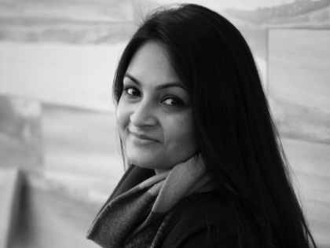

<main credit="Ashley Hamer" quote="There are no separate systems. The world is a continuum. Where to draw a boundary around a system depends on the purpose of the discussion. - Dona Meadows">

Hello!

For most of my adult life, my country (one of them anyway, being a dual citizen between the US and Canada) [has been at war somewhere else in the world](https://www.aljazeera.com/indepth/interactive/2020/02/war-afghanistan-2001-invasion-2020-taliban-deal-200229142658305.html). But the experience of that war for American civilians was often ambiguous or bureaucratic, not tactile or kinetic.

Recently, the announced agreement between the Taliban and US has been a sign that this defining conflict is drawing to a close, [but many unknowns remain](https://www.brookings.edu/blog/order-from-chaos/2020/03/04/on-afghanistan-give-peace-a-chance-but-be-wary-of-the-taliban/). Foremost amongst these concerns is how negotiations with the existing Afghan government will go (as they are not part of the US/Taliban negotiations). And the bigger question: what will happen to the rights and access that many Afghans have fought to establish amongst conflict, but outside of the Taliban’s day-to-day control.

Afghan women have particularly led these social changes, and have a lot to worry about with an unshackled Taliban. [While impressive strides have been made in women’s leadership](https://giwps.georgetown.edu/a-new-generation-of-afghan-women-leaders/), it’s often overlooked that the [status of women in Afghanistan had been progressive](https://www.amnesty.org.uk/womens-rights-afghanistan-history) prior to the Soviet-led coup in 1978. This event sparked the formation of an insurgent Mujihadeen and eventual rise of the Taliban in the 1990s, and with their rise, the persecution of and restrictions on women they enforced. A rehydrated Taliban power in Afghanistan might mean that much of what women have fought for in the past decades will be repressed again, and those women and men who have led that fight will face retaliation.

Consider this in the context of the impressive design work emerging from Afghanistan — both tangible product and services supporting people. I want to draw attention to [The Anabah Maternity Center](https://aquietrevolution.emergency.it/#/introduction) as a bright spot in how vital service delivery — in this case reproductive care — in Afghanistan is meeting both the health and cultural needs of those it serves. Originally created and supported by the Italian nonprofit Emergency, [the site has really grown into something led and operated by women serving the needs of their own community](https://brightthemag.com/health-women-maternity-afghanistan-security-da7a37b8e0bd). In a country where the female working population is (and will be) recovering from years of repression, we can celebrate the design and implementation of a healthcare system led and staffed solely by women. They support other women who otherwise wouldn’t have any healthcare options because of patriarchal and religious barriers.

Good design doesn't always come from those trained in design practices, but rather can emerge where a human centred disposition comes together with a systems-oriented mindset and an inclination to make something tangible. Design training and a tested process certainly facilitate and make repeatable that emergence, but as designers we can take a lot of inspiration from instances like Anabah: where its planners and operators performed great service design in the absence of a service designer.

That’s it for this week. As always, I’d encourage you to [subscribe](https://divergeweekly.com) if you haven’t and [send me a note](mailto:alb@andrewlb.com) if you have questions or feedback!

</main>

<region>

[[region | Americas]]
|[Coronavirus Fears Have Led To A Golden Age Of Hand-Washing PSAs](https://www.npr.org/2020/03/04/811609241/coronavirus-fears-have-led-to-a-golden-age-of-hand-washing-psas)
|With the surge in American Coronavirus cases, NPR takes a look at the numerous media touchpoints on hand washing as a mechanism to reduce spread. I'm personally following Quang Đăng's dance every time I wash my hands, weird looks be damned.

[[region | MENA]]
|[Farzana Wahidy’s portraits of Afghanistan](https://www.economist.com/prospero/2020/03/03/farzana-wahidys-portraits-of-afghanistan)
|She became the country’s first female photojournalist to work for international wire services, and she'll be sharing a collection of her work Women by Women in London.

[[region | East Asia]]
|['More scary than coronavirus': South Korea's health alerts expose private lives](https://www.theguardian.com/world/2020/mar/06/more-scary-than-coronavirus-south-koreas-health-alerts-expose-private-lives)
|Containing a pandemic is often a matter of surveillance and tracing connections between those affected. While Chinese surveillance culture is well known, the Coronavirus outbreak has revealed state surveillance in many societies, to the dismay of its citizens.

[[region | South Asia]]
|[Facebook, Google and Twitter Rebel Against Pakistan’s Censorship Rules](https://www.nytimes.com/2020/02/27/technology/pakistan-internet-censorship.html)
|Internet Censorship is a major issue around the world, cutting across autocratic, semi-democratic, and even some democratic regimes. The current situation in Pakistan and the response of the FAANG companies will be worth watching to understand the privacy and identity are being co-designed on the international stage.

[[region | Europe]]
|[Innovation Methodologies for Defence Challenges](http://militaryepistemology.com/imdc-2020-in-budapest-hungary/)
|Last week, the IMDC 2020 conference happened in Budapest, bringing together NATO military officials and design thinking practitioners in one room. It looked like an interesting event, and is perhaps a great pathway for bringing design practice into global affairs.

</region>

<security credit="Source Unknown">

[Google denies link to China’s military over touch-screen tools that may help PLA pilots](https://www.scmp.com/news/china/science/article/3017141/google-denies-link-chinas-military-over-touch-screen-tools-may)

An interesting look at how consumer UX expectations bleed into critical military and defence applications. Having been a product designer at the Pentagon myself, I can generally say that the state of military UX is pretty dismal EXCEPT for when it is mission critical. In a culture obsessed with Job Boyd's OODA loop, speed and efficiency for warfighters is a strong argument. Seeing how that is playing out in other militaries, I wonder if UX will become yet another front in great power competition.

</security>

<jobs>

<!-- [[featurejob]]
|[Sales Lead @ Knowsi](mailto:andrew@knowsi.com?subject=sales%lead)
|Knowsi manages the consent relationship between researchers and participants. Help us make design research more private and more inclusive to participants by spreading the word and building our product marketing strategy. -->

[[jobad | Co-Creation Manager]]
|[Co-Creation Manager, Aga Khan Foundation](https://3ga4b0g2bmm2x0mm4aptur1d-wpengine.netdna-ssl.com/wp-content/uploads/Local-Impact-Central-Asia-Project-and-Co-Creation-Manager-TOR_final_20200228.pdf)
|Located in the Kyrgyz Republic or Tajikistan, the Aga Khan Foundation works in poverty reduction in Central Asia. This looks like an incredible role to apply design experience both in defining a strategy for improving people's outcomes, and in co-designing that strategy with the folk who will ultimately be experiencing it. Apply before March 20!

[[jobad | Research in Turkey]]
|[Researcher, Amnesty International](https://careers.amnesty.org/vacancy/researcher---turkey-2803/2831/description/)
|Located in Turkey
|Amnesty International is looking for a researcher to report on human rights issues in Turkey and the surrounding region. While this appears to be a more traditional research role, and less of a design-centric one, I think it could serve as a fascinating bridge for a design researcher to transition their values and viewpoint into the policy space. In particular, emphasizing empathy and qualitative methods in your application would go a long way!

</jobs>

<sponsor image="https://www.knowsi.com/static/tier1.png">

## Knowsi

Knowsi manages consent for user research. Send and track participant consent with custom forms and GDPR-focused tools.

[Join Knowsi today for free!](https://knowsi.com)

</sponsor>

<image credit="John Snow" link="https://mappinglondon.co.uk/2014/mapping-cholera/">

</image>

<voices who="Fahmida Azad" role="Acting Head of Education, CIID">

Fahmida is a fascinating designer. I facilitated a workshop with her in Copenhagen, and got to see her methods for fusing critical discourse with design talent. She's a Bangladeshi-American service designer with experience working in education and NGOs around the world, including time spent in Palestine and Jordan. These days, she's leading education for the IDP program at Copenhagen Institute of Interaction Design and giving awesome talks at Interaction 20.

[What Designers can learn from Intersectional Feminism](https://interaction20.ixda.org/program/what-designers-can-learn-from-intersectional-feminism#speaker-fahmida-azad)

</voices>

<twitter who="hondanhon">

[JAMES BOND WILL RETURN IN DOUBLE DIAMONDS ARE FOREVER](https://twitter.com/hondanhon/status/1225872032639987714)

</twitter>

<!-- <classified>

[[classified]]
|[Join CIID around the world](http://ciid.dk/education/summer-school/) for dedicated master classes in design and prototyping skills hosted yearly in different cities around the globe.

[[classified]]
|Expecting a new family member? FitFaj prepares you for the challenge of parenthood with a customized workout plan that finishes right before your baby arrives. [Signup Today!](https://fitfaj.com)

</classified> -->
