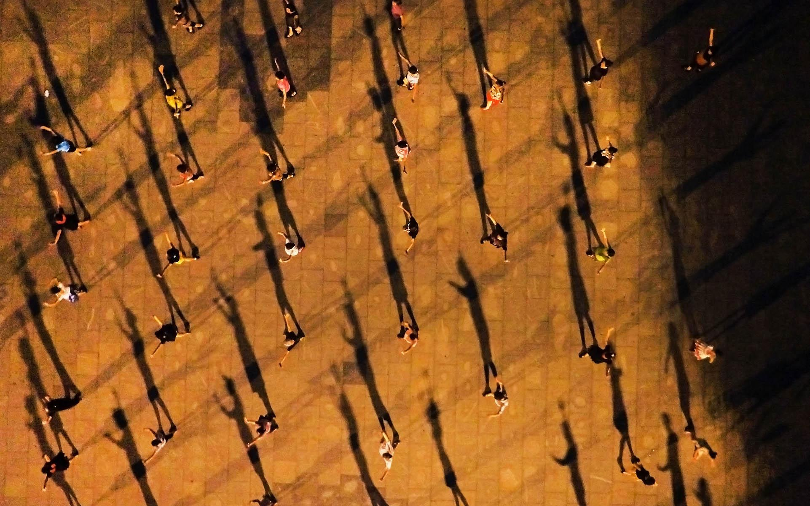
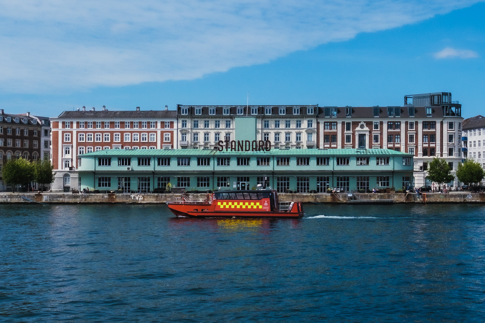
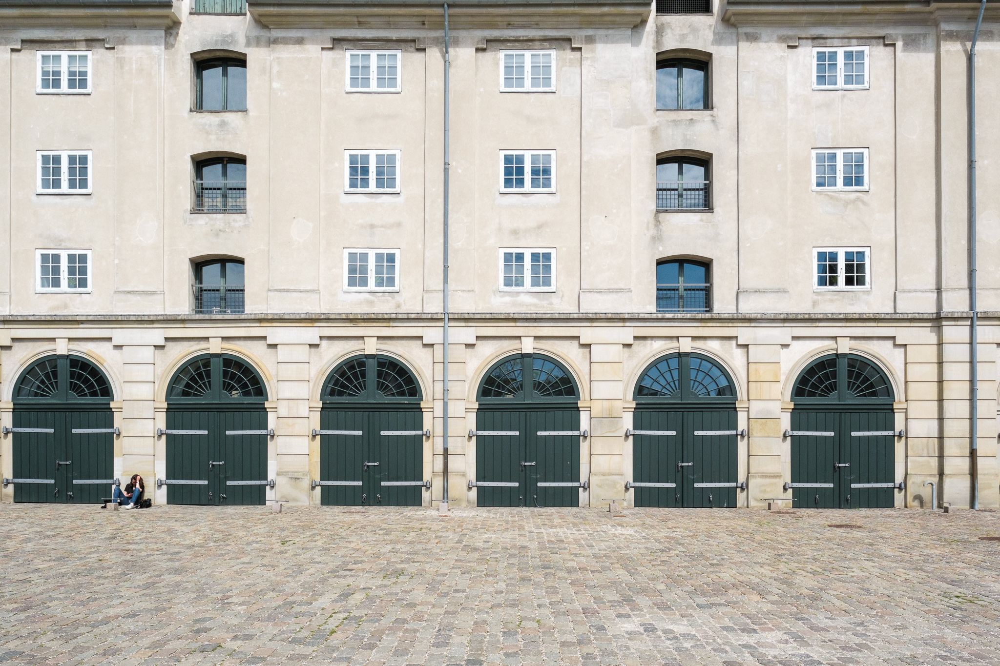
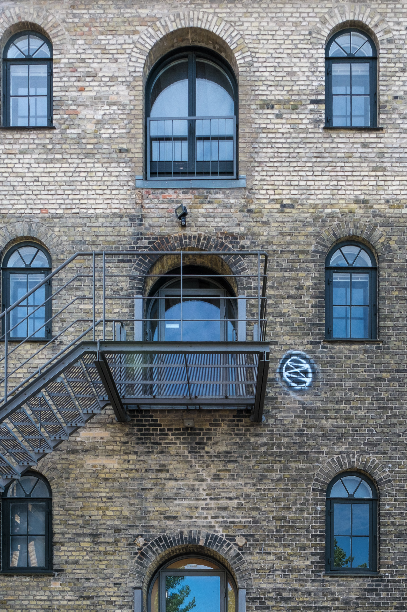
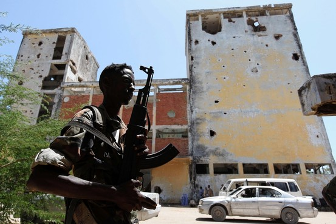
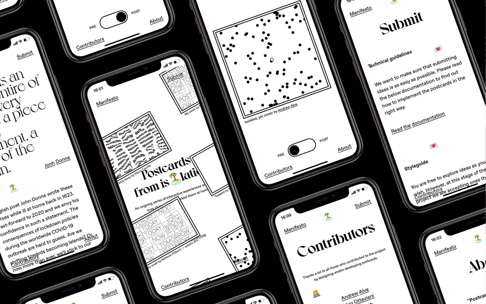

<main credit="Kunrong Chen, Daily exercise, 2014" quote="It occurred to me that no matter where I lived, geography could not save me. —  Isabel Wilkerson, The Warmth of Other Suns ">

Hi.

First, I want to share a point of gratitude. My small business, [Knowsi](https://knowsi.com), was awarded the [Sage Ocean Concept Grant](https://ocean.sagepub.com/blog/tools-and-tech/concept-grant-winner-knowsi-interview) this week by Sage Publishing. Knowsi is a solo project I’ve been slowly developing over the past year with the goal of improving informed consent practices in user research. It still has a long way to go, but I’m incredibly grateful for the help of the Sage Ocean team as well as all the friends, colleagues, research participants, and customers who have helped Knowsi in its first year. The goal over the next bit will be to extend it to support social science research needs as well (as well as generally get it out of public beta, whatever that means).

Anyway, onwards.

There’s a certain flatness to things recently.

Being in a lockdown with a tenuous end date makes for the psychological equivalent of sitting in the back seat, asking “Are we there yet” to an equally puzzled parent. For most of us living in liberal democracies, this is the most sweeping form of state control many of us have experienced — barring incarceration and military service. While we strained against that control in different ways —from [right wing protests in California](https://www.theguardian.com/us-news/2020/may/01/california-coronavirus-protests-huntington-beach-sacramento?CMP=Share_iOSApp_Other) to [pro-democracy rallies in Lebanon](https://www.voanews.com/covid-19-pandemic/lebanese-protesters-back-streets-despite-covid-19-lockdown) — the reality is that our leaders and institutions are as perplexed as we are: they can only read the signs on the road and actuate the vehicle of state incrementally along its existing path.

Decision making against the moving goal posts of economic and public health is at its core a challenge of perspective with existential consequences. I wrote an essay this weekend for a strategic studies course — the kind with nuclear weapons, hybrid warfare, and Prussian generals — and the only thing I felt I could write about was how narrow the idea of strategy can feel. Taken to an almost unhelpful level, strategy attempts to impose a kind of will or intent on complex systems that — by their very nature — resist such control. One examples was in the lead up to the Iraq invasion in 2003 [which Robert Jervis describe in detail](https://onlinelibrary.wiley.com/doi/abs/10.1002/j.1538-165X.2010.tb00672.x). In his account exploring policy maker use of intelligence analysis, the central challenges was not that the Bush administration didn’t have intelligence and awareness about Saddam’s regime: but rather they so convinced themselves of a procedural solution to that complexity, that the only obvious choice was to invade Iraq — no other option would do. Strategy became a lens through which details faded and flattened into an utterly catastrophic decision. Perspective is a function of how refracting and reflecting light eventually hits our eye: it is situational, subjective, and temporal.

The other part to this is the lens through which your particular perspective in consumed. My friend Scott Young [wrote a piece for the Canadian magazine Macleans on Sweden’s response to the Coronavirus](https://www.macleans.ca/news/world/lessons-from-kronavirus-is-swedens-anti-lockdown-approach-more-strategic-than-it-seems/) this week, and he makes the point “No one would predict the winner of the Stanley Cup on the basis of Game 1 in the first round, so why do so many feel comfortable excoriating Sweden so early in this pandemic?” This is a distinctly Canadian metaphor, but it’s on point. From my vantage point in Denmark, I’ve looked at Sweden’s response with shock and concern (especially with close friends in Stockholm and Malmö, Scott included). But I also got a haircut last week as Denmark opened, and I shared the [numb terror](https://divergeweekly.com/issue/7/) associated with sending my son to daycare earlier this month. In Scott’s article, he acknowledge that the Swedish stance is perhaps reckless, but how wide or narrow a lens we take dramatically affects the returned image.

A narrow [focal length](https://en.wikipedia.org/wiki/Focal_length) surfaces details further off and with greater specificity. It also might make different objects appear RELATIVELY closer than they actually are. Narrowing ones focus on a subject (to the exclusion of others) might pull a background object into the foreground as well, as a tourist in Italy does as they use [forced perspective](https://en.wikipedia.org/wiki/Forced_perspective) to hold up the leaning tower of Pisa. The effect of this is to [distort the data](<https://en.wikipedia.org/wiki/Perspective_distortion_(photography)#/media/File:Nybldgs.jpg>) and force a differing interpretation of outcomes. The Bush administration fell victim to distortion by simplifying the complexity of Saddam’s regional defence, sectarian, and political posture in Iraq (and if this is of interest, honestly, read Kim Ghattas’ [Black Wave](https://www.amazon.com/dp/B07X4CK1FF). I’ve mentioned it a few times now, but it is brilliant). The inability to manage this unforeseen complexity, including [disbanding Saddam’s Republican Guard](https://www.theguardian.com/world/2003/may/23/iraq) and the guerrilla violence that followed, came in part from this narrowed scope. Of course, a wide lens can present its own problems. Too much information, ill-defined subjects, and distortion can leave the viewer unsure where to look and how to act. Same perspective, different lenses, different story, different strategy.

So back to this flatness I’ve been wondering about.

I think most of us have taken a very narrow view to this pandemic, albeit from a multitude of different vantage points. The result is conflicting narratives about what falls between our present and a distant object. [Everyone fears the second wave of infection](https://www.politico.eu/article/as-europeans-dream-about-beach-holidays-experts-worry-about-next-virus-wave/), but the vantage from Copenhagen with the Danish government feathering the economic breaks vs. Sweden with its potentially newly resilient population ([or potentially not](https://nymag.com/intelligencer/2020/04/we-still-dont-know-how-the-coronavirus-is-killing-us.html)) will present a very different story — even focused on the same object. It might also mean that the next few months will look incredibly different for the two countries, and certainly for every country around the world. While states may shape the outer bounds of our day-to-day experience, we still have great agency to “set up the shot.” And perhaps together — sharing our different experiences and perspectives — we can lend a bit of dimensionality to unknown looming in the background.

As always, [please subscribe to and share Diverge Weekly](https://divergeweekly.com) if you haven’t and [send me a note](mailto:alb@andrewlb.com) if you have questions or feedback!

</main>

<voices who="Alex Neuman" role="Educational Designer" image="img/alex.jpg">

Alex is a Canadian/American educator and designer who found himself in Sweden many years ago helping build the Hyper Island team, and stayed long enough to learn some Swedish and get his Swedish citizenship. He currently lives in Copenhagen where he runs an independent practice and cofounded the CoLearn studio.

Real co-creative and participatory design practices are incredibly hard to get right in the room, let alone teaching others to become ace facilitators. Between mentoring entrepreneurs from the middle east, working throughout the nordics, and bouncing back and forth between Canada and the US, Alex brings an international perspective to the design of education that is incredibly rare and has had obvious impact through the extended work of his students.

[Alex Neuman](https://www.linkedin.com/in/alex-neuman-2a9b4a12/)

</voices>

<twitter who="clastowka">

[Legendary scene in Seven Samurai where they address people not wanting to wear masks when they shop at TJ Maxx](https://twitter.com/clastowka/status/1259851352462766084)

</twitter>

<region>

[[region | East Asia]]
|[South Korea Tries a Tentative Reopening—and Pays for It](https://foreignpolicy.com/2020/05/11/south-korea-reopening-coronavirus-outbreak-social-distancing-second-wave/)
|My fear is that Denmark is heading this way — overly confident in an initial success. To quote the South Korean health minister in this article: “We need to be ready to have the second wave at any time. I think we need to think of it as a given scenario, it’s inevitable.”

[[region | South Asia]]
|['No miracle': What explains Bali's low coronavirus cases?](https://www.aljazeera.com/news/2020/05/miracle-explains-bali-coronavirus-cases-200502035557649.html)
|At first consideration, Bali seems to have a low infection rate, but there might be other explanations, including a mostly asymptomatic outbreak. This has the potential to be a human time bomb when it comes to tourism and migration, and suggests that whatever services designed during the coronavirus pandemic will have to assume everyone is potentially infected.

[[region | Americas]]
|[How the virus may change your next home](https://www.nytimes.com/2020/05/12/realestate/how-the-virus-may-change-your-next-home.html)
|With the lockdown already changing so much, the unpredictability with which we have been shut into our homes now and in the future will become a design constraint. Definitely a US-centric lens on the architecture and design, but a worthwhile read. I'd really like to read a similar article for multigenerational households.

[[region | MENA]]
|[Epidemics, war have impacted Muslim worship throughout history](https://www.aljazeera.com/news/2020/04/epidemics-war-impacted-muslim-worship-history-200420210254391.html)
|I read “The End of October” recently, which included a coronavirus outbreak during the Hajj and I was curious to learn a bit more. Beyond our current crisis, AJ shared some historical context for the current lockdown during one of the most significant times of the Islamic calendar.

[[region | Africa]]
|[The Pandemic Is Laying Bare a Global Water Crisis](https://foreignpolicy.com/2020/05/12/coronavirus-pandemic-global-water-crisis/)
|Subsistence-level infrastructure is designed to break under stressed. Part of my entry into design was actually political science: through the the systems analysis work of Thomas Homer-Dixon in his book Environment, Scarcity, and Conflict. Exploring and visualizing causal chains within economic and political systems helped massively in my work in interaction design and design research. This is one domain where design is desperately needed: not in the moment of crisis, but rather to offset this fragility when developing programs to support the most vulnerable.

[[region | Europe]]
|[World War II and the battle over collective memory in Eastern Europe](https://www.dw.com/en/world-war-ii-and-the-battle-over-collective-memory-in-eastern-europe/a-53356626)
|On the topic of lenses, I found this article to be pretty interesting. Putin is a leader with a strong sense of national history, and his resonance towards World War II as a moment of national pride and unbelievable trauma for Russians makes for an interesting analysis.

</region>

<security credit="Foto: REUTERS">

[The problem with militias in Somalia: Almost everyone wants them despite their dangers](https://www.brookings.edu/research/the-problem-with-militias-in-somalia-almost-everyone-wants-them-despite-their-dangers/)

I thought this was pretty interesting. It’s not too often that articles like this recommend the acceptance and embrace of complexity.
This article explores an important way to consider multilateral engagement in the context of vulnerable states: working with and collaborating with militant groups. Somalia has had a difficult ride. From the civil wars in the early 1990s, a popular kritocratic governing coalition — the Islamic Court Union — emerged but was undermined through foreign support for the weaker (and secular) Somali government. Of course, aspects of this were reasonable: al-Shabaab, a violent Jihadi group, was allied with the ICU, but its dissolution has further fragmented the Somali political landscape. Part of the issue at hand is that navigating the Somali political landscape comes down to negotiating with disparate forces whose power and position are incredibly fluid. For anyone looking to do work in Somalia —neighbouring regime, an NGO, a superpower, or a terrorist group — that work comes at the cost of navigating a deeply complex web of relationships and power structures. But, it isn’t impossible.

</security>

<jobs>

[[jobad | Food Innovation with the IRC]]
|[Innovation Strategy Lead, International Rescue Committee](https://rescue.csod.com/ux/ats/careersite/1/home/requisition/9002?c=rescue)
|Located in New York, USA
|
|Bit of a dream job here. Focused on global nutrition projects, they're looking for someone with product and innovation experience, preferably with an MBA to work with their Airbel center. I'd imagine a business designer — someone fusing a human centered and quantitatively adept mindset — would be a good candidate for this role.

[[jobad | Non-profit Designer in Canada]]
|[Senior Designer, McConnel Foundation](https://mcconnellfoundation.ca/job-opportunity-senior-designer-mcconnell-foundation/)
|Located in Montreal, Canada
|
|A fairly traditional communications design role with a well established progressive non-profit, this would be a interesting glimpse behind the curtain of the nonprofit world if you've been looking for that opportunity. Having had some experience on that side myself, it's not something you get into overnight. Taking that first step in a familiar role and growing into other capacities might make for an exciting career path.

</jobs>

<sponsor image="https://www.knowsi.com/static/tier1.png">

## Knowsi

Knowsi manages consent for user research. Send and track participant consent with custom forms and GDPR-focused tools.

[Join Knowsi today for free!](https://knowsi.com)

</sponsor>

<image credit="Postcards from Isolation" link="https://isolation.is/">

Postcards from Isolation is a lovely and interesting web experiment on the effects of isolation on experience. I had a great time poking around in it, and got a lot from exploring the different experiments. Give it a look!

</image>
