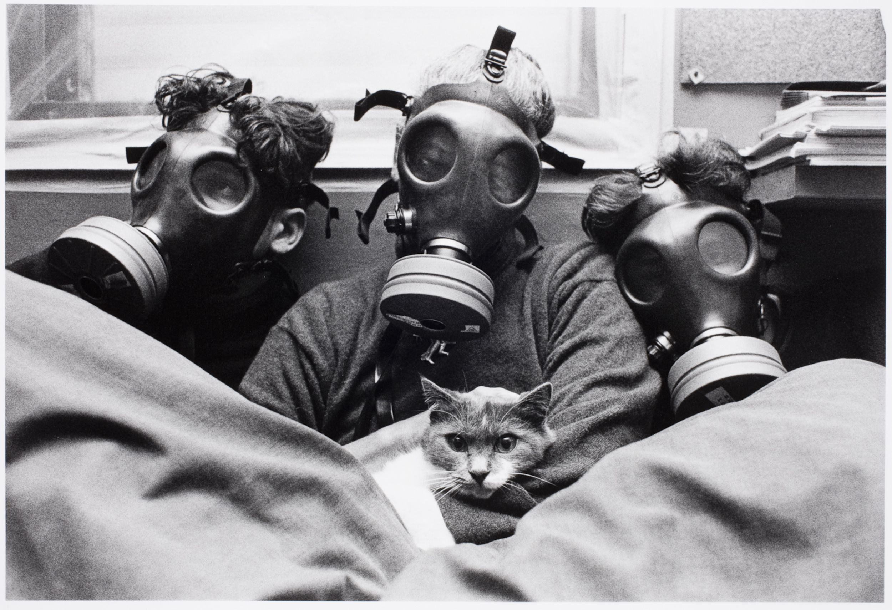
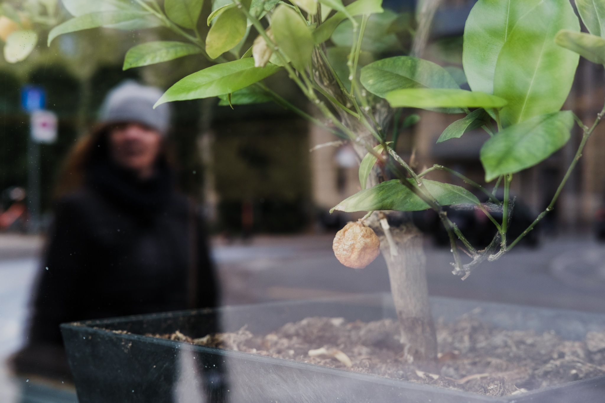
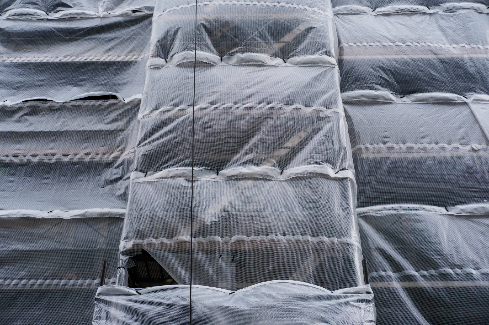
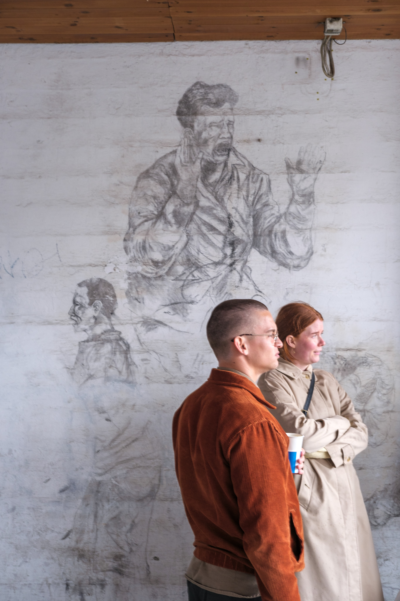
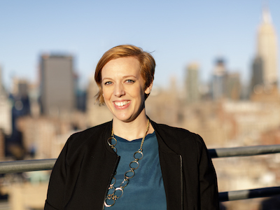
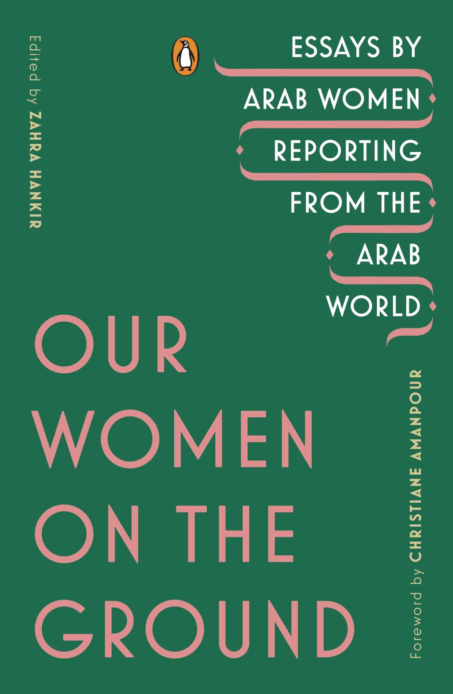
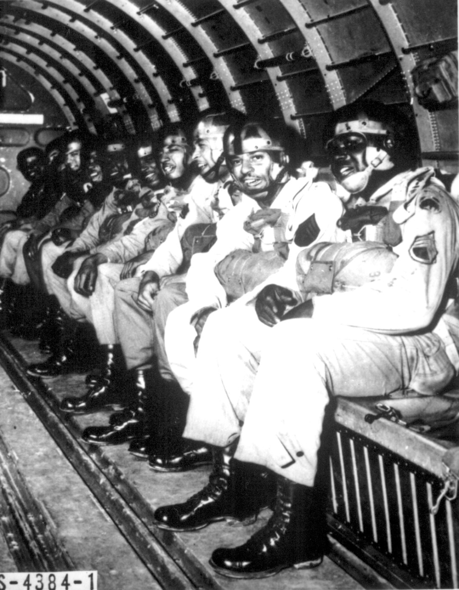
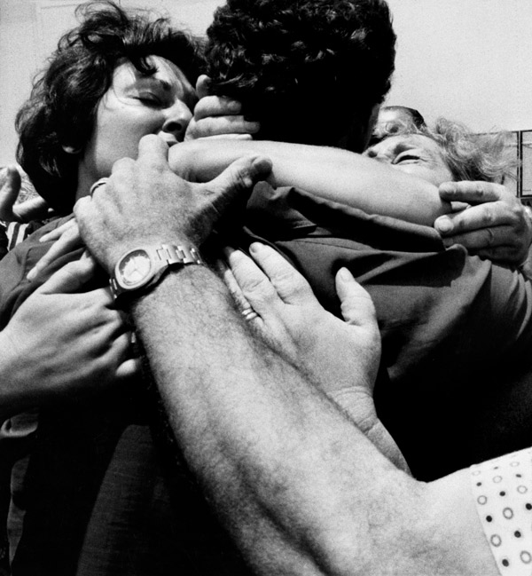

<main credit="Bar-Am Micha" quote="Home is what you take with you, not what you leave behind. - N.K. Jemisin, The Fifth Season">

Hi,

It’s been 70 days since my family and I hit “go” on our particular lockdown, only preceding the overall lockdown in Denmark by a few days. In that time period, a lot has happened for us and for everyone else, but it’s been consistently encapsulated anticipation — that we’re waiting to understand the road we’ll be on tomorrow. I’ve heard a lot of folk describe our current state as a kind of limbo.

A year and a half ago, I interviewed a number of people who worked with refugees and displaced peoples. One of these was Nick Hayes, who [wrote this article](https://www.theguardian.com/books/2016/mar/12/nick-hayes-graphic-artist-pictures-refugees-calais-camp-jungle?CMP=Share_iOSApp_Other) on his time volunteering at the Calais camps (colloquially known as The Jungle) in Normandy, France. Nick’s article comes to mind right now as I think about the cause and effect of anticipation.

For a refugee who finds themselves at the Calais camp, waiting is the imposition of a system against you. Many things can drive someone to migrate — war, hunger, opportunity, persecution — but that act of migrating suddenly situates you within a system that is both outside of what you can tacitly navigate, and often actively hostile to your social interface with it. Nick’s description of the Calais experience becomes one of waiting: for an opportunity to continue onwards, for something to happen, for strength to return, for a system to open. This is a limbo where you KNOW something is on the other side, and for reasons outside of your control, you don’t have access.

We are all experiencing a different kind of waiting. Instead of transitioning between systems and social contexts, we are instead seeing a system reshaped around us. The flash of anger when someone gets too close in a grocery store, the anxiety around consuming what was a few weeks ago a basic service, or even the recognition of “essential” labour within a society (and what that actually means) — all manifestations of our orbits being changed relative to some new and sudden phenomenon.

In Hyper Objects, Tim Morton describes a class of object that are almost larger than we can understand, possessing a complexity that we can’t wrangle, aggregate, multidimensional, atemporal, etc. Climate change is one such example: a phenomenon that transcends time, space, and location yet is descending on us like a bomb (but we don’t know when). [Styrofoam is another](https://www.hcn.org/issues/47.1/introducing-the-idea-of-hyperobjects): physical, but lasting forever and accumulated beyond our control. Coronavirus is too, which [Morton pointed out on twitter](https://twitter.com/the_eco_thought/status/1234828156449759232?s=20). In fact, one could argue that a pandemic as an abstract thing and THIS pandemic are now independent — covid-19 having presented itself to society.

One quality of hyperobjects is that they exert their own gravity: pulling other things with lesser weight off kilter and transforming the world around themselves. We’ve already seen this with the refugee crisis of the past decade— for all the horrible dynamics of the Syrian civil war, there’s a strong argument that [climate change served as a primary factor](https://daily.jstor.org/climate-change-and-syrias-civil-war/). A friend of mine, Britt Wray, has spoken about this in her [research around climate change and anxiety](https://www.ted.com/talks/britt_wray_how_climate_change_affects_your_mental_health/transcript?language=en). We collectively sense what’s coming for us: whether we respond to that with denial, activism, or just slowly increasing blood pressure. That same force has hit us with Covid-19, which projects its own gravitational force today— bending existing plans and shifting our orbits towards previously unknown axes.

I’ve personally found that projecting a degree of objectivity overtop of the current existential threat helps. Not because I can do anything about It with a capital I, but rather because those things that I can affect are often highlighted against its surface, and likewise pulled into its orbit. We’re all waiting to see what our new orbit will be.

_A quick request!_ There's a lot more of you than there used to be, and would love to get some feedback. _If you have a few minutes, please [fill out this short survey](https://andrewlb.typeform.com/to/aQPfsG), and let me know what you think of Diverge._ Alternatively, you can always respond to this email to reach me directly.

As always, [please subscribe to and share Diverge Weekly](https://divergeweekly.com) if you haven’t and [send me a note](mailto:alb@andrewlb.com) if you have questions or feedback!

</main>

<voices who="Georgia Bullen" role="Executive Director, Simply Secure" image="img/ ">

Georgia Bullen is a whirlwind. I first got to know her at New America, where she was overall technology director and head of the Measurement Lab project — any time you googled “Internet Speed Test”, that was her and her team. Georgia is also probably the primary reason I survived my time at New America: a completely new context to where I’d worked before. She took the time and interest to help me navigate that community and find a focus in my work.

Since then, she’s moved on to become the ED at Simply Secure, a nonprofit using design and technology expertise to support open technology work, work with vulnerable populations, and develop core infrastructure for the open internet. Georgia is an incredible connector of people and ideas (seriously, I’ve never seen anything like it), and I can’t encourage you enough to follow the work of her and her team.

Go checkout Georgia’s work at Simply Secure and join the community she’s developing!

[Simply Secure](https://simplysecure.org)

</voices>

<twitter who="simondrex">

[I wanna be in the Zoom where it happens](https://twitter.com/simondrex/status/1261306100067954690?s=20)

</twitter>

<region>

[[region | East Asia]]
|[How South Korea prevented a coronavirus disaster—and why the battle isn’t over](https://www.nationalgeographic.co.uk/science-and-technology/2020/05/how-south-korea-prevented-a-coronavirus-disaster-and-why-the-battle)
|I've written about South Korea quite a bit as one of the exemplars of managing this crisis, but I found this article in national geographic to be a good encapsulation of many of those more fragmented narratives. Plus with some lovely photography.

[[region | South Asia]]
|[Singapore schools to open June 2, with most alternating weekly between online learning and classes in school](https://www.straitstimes.com/singapore/education/spore-schools-to-open-june-2-with-most-alternating-weekly-between-online)
|The impact of covid-19 on education and especially the transitional experience of students going between university educational levels has had a lot of attention. This strategy of batching and spreading out risk to students and major infection events is one worth following.

[[region | Americas]]
|[U.S. Authorities Say Hobby Lobby’s Gilgamesh Tablet Is ‘Stolen,’ Must Go Back To Iraq](https://www.npr.org/2020/05/19/858605788/u-s-authorities-say-hobby-lobbys-gilgamesh-tablet-is-stolen-must-go-back-to-iraq)
|Okay. Each week I try to orient the news articles around the theme of the week. But a country waiting for artefacts of its heritage to be returned after being stolen by a corporation (that insists that it’s a person) for display in said corporations religious-themed museum is a bit much. FFS.

[[region | MENA]]
|[Egypt: All staff at Al-Azhar Hospital contract COVID-19 – Middle East Monitor](https://www.middleeastmonitor.com/20200514-egypt-all-staff-at-al-azhar-hospital-contract-covid-19/)
|This is the scary part. Capacity comes in many ways: the number we’ve seen floated most frequently is around ventilators, but when medical staff succumb to disease, both immediate capacity to care and the contributions of these professionals long term is at risk. With the long-term health effects of covid-19 still unknown, the impact of a 100% infection amongst the healthcare sector may be felt for decades.

[[region | Africa]]
|[South Africa coronavirus: Cape Town has 10 percent of Africa?s confirmed cases - The Washington Post](https://www.washingtonpost.com/world/africa/south-africa-coronavirus-cape-town-superspreader/2020/05/18/4d332248-9566-11ea-87a3-22d324235636_story.html)
|South Africa is starting to ease its lockdown, after having seen some evidence of success. I continue to be interested in the emphasis on “super spreaders” (usually asymptomatic people going to high-traffic areas) as a primary vector for the virus, and what that will do to global infrastructure going forward — Airports, sports stadiums, groceries, factories.

[[region | Europe]]
|[As Italy’s Coronavirus Lockdown Eases, ICU Patients Begin Long Recovery](https://foreignpolicy.com/2020/05/16/italy-next-phase-coronavirus-pandemic-recovery-lockdown-health-care/)
|Reading this article was devastating. Restarting a life after something so traumatic is terrible, and it will be a scar that many will likely hide. How do we design for a physically and mentally devastated population like this?

</region>

<reading title="Our Women On the Ground" author="Zahra Hankir">

[Our Women on the Ground: Essays by Arab women reporting from the Arab world](https://amzn.to/3cLDzZK)

This is a bit of a new section, but I think it makes sense given my reading schedule. I’ve been reading this book the past week, and have been utterly transfixed. Written from the perspective of journalists and photographers from across the Arab world, _Our Women On The Ground_ contains a series of essay capturing angles on the experiences that shaped them: professionally, personally, and in the spaces in-between. One essay might interrogate the authors’ relationship with her father and the patriarchy of the Egyptian state relative to her growing identity as an activist and journalist. Another might recount how her own upbringing in the west ill-prepared her for the relationships and hospitality she encountered returning to Iraq as an adult. Still another explores the practice of building relationships with sources in Syria and the numbness that came as those sources became radicalized, fled, or were killed.

So far, the book seems to focus around some of the shared events that drew many of these authors in as reporters. The Iraq war, the Syrian civil war, the rise of ISIS, and the hope that the Arab spring represented feature prominently. I’m incredibly grateful for this book and the dimensionality that it brings to the recent history of the Arab world. I really can’t recommend it enough.

</reading>

<security credit="Source: National Archive">


[Of Course the U.S. Military Has A White Supremacy Problem. It’s Baked In. - War on the Rocks](https://warontherocks.com/2020/05/of-course-the-u-s-military-has-a-white-supremacy-problem-its-baked-in/)

On the theme of waiting, this caught my attention. War on the Rocks is an interesting professional publication. It’s well respected in the American national security establishment, and many of its writers are colonels, generals officers, and senior officials currently or previously within the US Department of Defense. So when an article explicitly criticizing long-term cancer of racism and white supremacy within the American armed forces, it’s a preliminary signal that perhaps things are moving in a better direction.

America has never really reconciled with its history of slavery and systematic oppression of black Americans. The result has been generations of potential undermined through active and passive discrimination, and a society that still bares an open, festering wound. But the military can — in principal — serve as an exemplar for a kind of cultural and historical healing. Through its hierarchal structure, the education of its officer corps, and the dispositional towards historical awareness of its members, I’d argue that it has symbolically and actually greater power than American federalism allows outside of the federal armed forces. With the role that the military plays as an employer and opportunity-creator for millions of Americans (there are currently 18 million veterans in the US), that change in who is celebrated in bases, statues, ship names, and heroics has the potential to create an enduring impact and perhaps shorten the wait for some kind of healing.

</security>

<jobs>

[[jobad | Global UX for final inclusion]]
|[UX Designer, Accion](https://jobs-accion.icims.com/jobs/2074/consultant---ui-ux-designer/job?mobile=false&width=1333&height=500&bga=true&needsRedirect=false&jan1offset=60&jun1offset=120)
|Located in Latin America and India
|
|This looks like a pretty rad UX role in an impactful non-profit focused on financial inclusion. It's a remote role, but they're looking for someone already located either in India or Latin america. This looks like a pretty awesome role, and would jump on it if you think you can contribute.

[[jobad | Intern at the Red Cross/Crescent]]
|[Inclusion and Diversity Internship, IFRC](https://www.ifrc.org/en/who-we-are/working-with-us/current-vacancies/job-description/?id=51215)
|Located in Switzerland
|
|Get on this quickly if it's interesting for you as it closes on the 21st! The IFRC is looking for someone to support on their diversity and inclusion initiatives who is a recent graduate. Personally, I think someone coming from a human centered design program should try their hand at these types of roles. As someone who interned in the policy space before becoming a designer, that experience has had an enduring impact and you have the opportunity to bring a new perspective.

</jobs>

<sponsor image="https://www.knowsi.com/static/tier1.png">

## Knowsi

Knowsi manages consent for user research. Send and track participant consent with custom forms and GDPR-focused tools.

[Join Knowsi today for free!](https://knowsi.com)

</sponsor>

<image credit="Bar Am Micha" link="https://www.magnumphotos.com/photographer/micha-bar-am">

[Micha Bar-Am](https://www.magnumphotos.com/photographer/micha-bar-am/) is an Israeli photographer who worked extensively in chronicling life on a [Kibutz](https://www.magnumphotos.com/arts-culture/society-arts-culture/the-source-of-light-israel-kibbutz-judaism-micha-bar-am-palestine/), and the early days of the Israeli state and the conflict that came with it. Currently ninety years old, he continues to photograph and curate photographic works in Israel.

</image>
