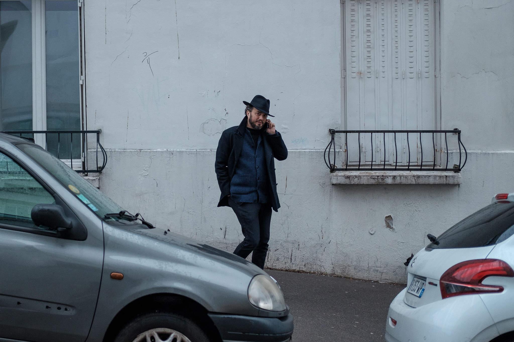
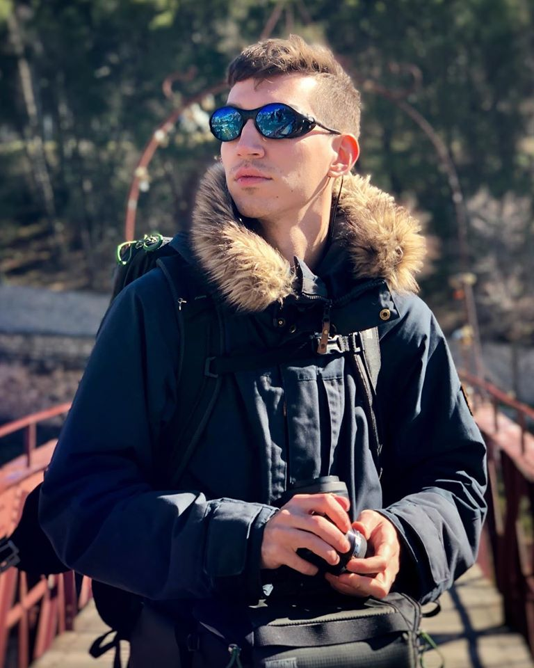
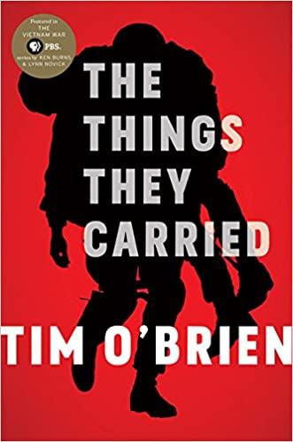
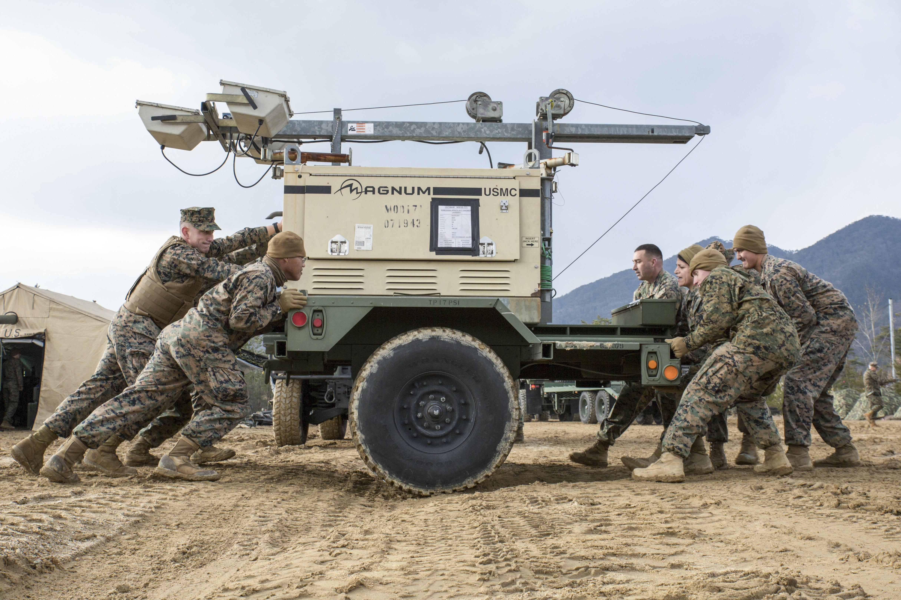

<main credit="" quote="">

Hi all,

Being a creator of things — software, products, services, policy, etc — means navigating a world of constraints. There were two stories of constraints that I encountered in the past week which I wanted to share.

The first is about constraints on a geopolitical scale. My friend Chris introduced me to a new podcast called [Wind of Change](https://crooked.com/podcast-series/wind-of-change/), which explores the potential CIA sponsorship of a popular eighties power ballad pushing for European unification. Its an absolute trip (the type that starts with a reluctant listen followed by binging most of it), but it tells an interesting story of constraint.

Given the competition between American and Soviet blocs during the Cold War, many different mechanisms for influence spun out for lack of the more direct military one. Instead of the two nuclear armed powers going toe-to-toe, competition occurred through proxy conflicts as with the Soviet engagement in Afghanistan vs. the CIA-backed Jihadis, and through foreign interventions in the domestic politics of polities across Africa, MENA, and LATAM. It also occurred through weaponized culture from posturing in chess and the olympics, [smuggling banned literature](https://www.cia.gov/library/readingroom/collection/doctor-zhivago), and perhaps this particular power ballad. As justifiably divisive as the CIA can be, that such an innovation might have emerged from the constraints presented by the Cold War and the bureaucracy of the CIA is itself a fascinating mystery to explore.

Constraints create context, and context begets emergence. The speculation about the CIA’s involvement in a heavy metal band has some credibility partially because these clandestine agencies were scrambling to find ways of exerting influence when the old methods were no longer tenable options. The whole violent history of humanity skidded to a stop in the twentieth century when the nuclear sword of Damocles was strung up, but as far as states were concerned, that looming threat didn’t stop them from attempting to exert power and influence. Just… without cutting the string.

There are also those structural constraints which simply close options to individuals. As I mentioned last week, [Our Women on the Ground](https://amzn.to/36y6yOr) is a focused survey of those systematic constraints. A collection of essays by Arab female reporters, the book recounts many different experiences of becoming professional journalists in societal conditions that create incredible —sometimes violent— friction towards those identities.

A favourite was the essay by Amira Al-Sharif, a Saudi photo journalist who grew up in Yemen. One of her stories recounts being stopped and detained because she wasn’t traveling with male relatives — and was forced to sign a statement acknowledging that doing so was considered “shameful” in the eyes of the state, or at least the eyes of that agent of the state. Because of her interwoven identities — as a someone who grew up in Yemen, as a woman, as a reporter, and as someone against whom an armed authority figure projected a paternalistic power structure — the scope of what and where she can report, and ultimately who she is able to be becomes inexorably constrained. And yet, reading her essay and her included photography, these constraints have also given her a lens and sensitivity that empowers her to tell stories and capture photos no one else could.

Amira and her fellow authors in Our Women on the Ground expressed and creates as fervently as they could — each encountering different and overlapping constraints in their individual countries, cultures, and communities. Lina Attalah, founder of [Mada Masr](https://madamasr.com/en), writes of her evolving relationship with her father, relative to her identity as a feminist, an activist, a journalist, and an entrepreneur in Egypt. That consideration helped her find a point of connection as well: wondering how the constrained expectations the state had imposed on her father trickled down to her experience with him, and the construction of her own identity.

All of this to say that some strange, terrible, and wonderful things can emerge from constraints. People become who they become; designs resolve with the needs, resources, and context at hand; and sometimes a particular geopolitical strategic context begets some chart-topping power ballads. Thinking about the constraints from which something emerges IS ultimately the story of that particular something.

As always, [please subscribe to and share Diverge Weekly](https://divergeweekly.com) if you haven’t and [send me a note](mailto:alb@andrewlb.com) if you have questions or feedback!

</main>

<voices who="Simon Herzog" role="CEO, Anglemap" image="img/simonherzog.jpg">

Some people are natural explorers. I met Simon through my work and teaching with the Copenhagen Institute of Interaction Design, and our topics of conversation ended up swinging around quite wildly. Simon’s background is a bit all over. He has a background in business and venture capital, has worked as a prison guard, has hiked all around the world, and currently runs professional facilitation and education programs globally. You’re as likely to run into him hiking the Pamirs as you are to see him teaching a workshop in Tokyo or running a research program in Mumbai.

Beyond that, he’s also an avid birder, maker of clothing and camping gear, and the son of Werner Herzog and Christine Maria Ebenberger. He runs a design consultancy called Anglemap, which you should consider working with.
[Anglemap](https://www.anglemap.com/)

He also recently created an application for walking in others footsteps. It’s pretty fascinating.
[‎Peregrine Journey (IOS)](https://apps.apple.com/dk/app/peregrine-journey/id1430790121)

</voices>

<twitter who="KarlreMarks">

[If there's an article you want to read behind a paywall, you can print the tweets that quote from it and piece them together like a puzzle.]https://twitter.com/KarlreMarks/status/1264858292867784705)

</twitter>

<region>

[[region | East Asia]]
|[Why Japan Doesn’t Learn English](https://foreignpolicy.com/2020/05/26/japan-doesnt-want-to-become-another-casualty-of-english/)
|This was an interesting one, as ultimately it seems a service and instructional design challenge with massive societal effects. The way one studies for an exam is perhaps not how one studies for language proficiency, leaving many behind.

[[region | South Asia]]
|
|

[[region | Americas]]
|[ How Cubans Lost Faith in Revolution - The New York Times](https://www.nytimes.com/2020/05/23/opinion/sunday/how-cubans-lost-faith-in-revolution.html)
|The story of Caridad Limonta paints an interesting societal picture through an individual loss of faith in ideology and purpose.

[[region | MENA]]
|
|

[[region | Africa]]
|
|

[[region | Europe]]
|[The Kingdom of Denmark: Battleground for Great Power Competition over Control of the Arctic Region](https://www.cgai.ca/the_kingdom_of_denmark_battleground_for_great_power_competition_over_control_of_the_arctic_region)
|I actually found this pretty interesting. CGAI is a hawk-ish for Canada defence think tank that puts out some decent work. This analysis raised some interesting points on the geopolitical position Denmark will find itself in balancing the US, Canada, and Russia for control of the Northwest passage.

</region>

<reading title="The Things They Carried" author="Tim O'Brien">

I read this book for Veterans Day last year and was pretty struck by it. It’s a series of short stories that are partially real, partially fictionalized account of the author’s experience as a young officer in Vietnam. O’Brien quite brilliantly explores the balance between the real and the half remembered — the way that memory, distance, and shapes our emotional experience and identity afterwards. The eponymous chapter explores what each individual carried with them, and sets the tone for the detail and personality of the rest of the book. It’s really fantastic, sobering, and ultimately a pretty quick read that leaves you with a lot to consider.

[The Things They Carried by Tim O’Brien](https://amzn.to/3gC8aLE)

</reading>

<security credit="Cpl. Donato Maffin">

[Women in Combat: Five-Year Status Update | Center for a New American Security](https://www.cnas.org/publications/commentary/women-in-combat-five-year-status-update)
Very American centric, but an interesting survey on the role of women in the combat arms of the US military. Structurally there remains a huge number of barriers, and the military does appear to be making steps towards opening up those roles.

The section on the special forces community is significant. Women have always worked with special forces teams, but often as outsiders or support personnel. In the US military, JSOC has its own procurement and healthcare system that supports the increased risk its members face, and many of those support roles which can face the same risk don’t get the same level of care if they get hurt, or quality of equipment to prevent injury in the first place.

So. This is worth keeping an eye on. Countries like Norway and Israel both include women in compulsory conscription, Russia has historically seen considerable female participation in combat roles, and Canada opened up all roles to women in the eighties with our charter of rights and freedoms.

</security>

<jobs>

[[jobad | ]]
|
|Located in
|
|

[[jobad | ]]
|
|Located in
|
|

</jobs>

<sponsor image="https://www.knowsi.com/static/tier1.png">

## Knowsi

Knowsi manages consent for user research. Send and track participant consent with custom forms and GDPR-focused tools.

[Join Knowsi today for free!](https://knowsi.com)

</sponsor>

<image credit=" " link=" ">

sdfsdf

</image>
