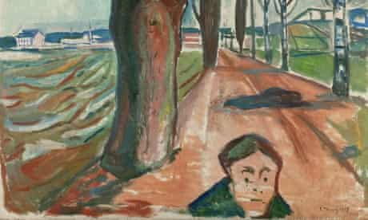

<main credit="Edvard Munch" quote="Modern economies are vastly complicated. Somehow they must process immense quantities of information—concerning the tastes and incomes of consumers, the outputs and costs of producers, future products and methods of production, and the myriad of interdependences of all of the above. The task of gathering this information, let alone making sense of it, is beyond any designing intelligence. But it is not beyond the market, which yields ‘spontaneous order’ out of chaos. — The Economist's obituary to Friedrich Hayek">

Hi.

You’re likely at home, or I hope you are able to be.

Last week, [I wrote about the balance of intervention and foresight](https://divergeweekly.com/issue/2/) in a design-based response to the coronavirus pandemic, and closed with the William Gibson quote “The future is already here — it’s just not very evenly distributed.” This means two things: physically and in our daily lives, some of us are experiencing Covid-19 on different schedules and scales, with Italy being the most egregious case. _But it also means our individual construction of the future in a pandemic is relative to our own experience_, and that is the focus here.

Here are three scenarios of this construct that I’ve seen:

- 1.  _An act of Apprehension_
      I’m in Denmark right now, and writing this on Saturday, March 21st. My wife, my one year-old son, and I have been self-isolating for 10 days, as have many of our friends. Today, it’s been two weeks since the last major outing, meeting with some friends for lunch. This apprehension is a judgement of risk relative to the array of possible futures at the point of decision, and making a “best guess” for which set of possibilities we should prepare. We might have felt pretty dumb pulling our son from daycare a few days early if things had turned out fine, but since [I’ve worked remotely for two years now](https://andrewlb.com/writing/remotework/) we had the right tools and support set up so that the cost of being wrong was effectively my son joining a few video meetings and my exhaustion. Ultimately, an act of apprehension can go either way, and is a gamble on trying to position oneself along a more preferable future.

- 2. _An act of Mitigation_
     Only yesterday, my university in the UK announced that they were closing the school and modifying distance courses: despite the fact that by percentage of the population, [the UK has a higher rate of cases than Denmark](https://cream.io/?m=tcpp&r=United%20States%2C-45&r=Italy%2C-35&r=South%20Korea%2C-31&r=Denmark%2C-45&r=United%20Kingdom%2C-45&s=log&z=3) – even with Denmark being in lock down for over a week. As cases and deaths grow, [PM Johnson’s reactions have been compared to that of the Mayor in Jaws](https://www.theguardian.com/commentisfree/2020/mar/20/coronavirus-myth-economy-uk-business-life-death), keeping the beach open for tourist season despite a murderous shark in its waters. Here then, our action and judgement is responsive to independent variables and driven by the same. Apprehension may drive our consumption of information, but the action of mitigation is only to offset damage that is already being done.

- 3. _An act of Ignorance_
     The most worrisome trends are where no action is being taken at all or the threat is seen as negligible. In Denmark, I was shocked to see folk pushing past each other while grocery shopping and the school closure being seen as an excuse to party, not shelter. This aligns with the stories of [American students congregating on beaches for spring break](https://www.bbc.com/news/av/world-us-canada-51955362/us-students-party-on-spring-break-despite-coronavirus), or worse, [exposure by those attending the rallies of Brazilian president Bolsonaro](https://politica.estadao.com.br/noticias/geral,bolsonaro-tem-contato-direto-com-ao-menos-272-pessoas-durante-ato-mostra-video,70003234397). This route is either willful or unintended: resulting from a dearth of information or — worst of all — given the information available, doing nothing or doing harm.

The problem with these three actions is that they reflect an inflection point that is being considered by everyone: informed by their lived experience, their state of mind, societal pressures, and access to resources. My decision to self isolate 10 days ago might have occurred at the same moment in time as someone’s decision that spring break was a great idea.

But these decisions and actions have vital influence on our future and the outcomes we march towards. Design futurist Stuart Candy is well known for his Cone of Possibility, a rendering of the present squeezing a series of potential futures through its aperture. The question is: when does the future catch up and which set of actions lead us to what is preferable?

If we’re looking at the longer tail of this crisis, apprehension, mitigation, and ignorance might not be all that different in terms of collective outcomes, but they ARE decisions that we make. This pandemic is a collective action problem: individual actions might offset or buffer one from the worst (or in the case of the spring breakers, drastically increase their own and others’ risk), the aggregate outcome is still likely to be the same. But then the question is, at what scale?

If individual action is smoothed over from the lens of the aggregate action or inaction of others, then I would argue that the route to designing an intervention is to _identify the scale and scope of intervention_ so that ones actions have an outsized effect. Is it the country? The state? The community? The family?

Consider the [the open source community's effort to expand access to life-saving ventilators](https://github.com/PubInv/covid19-vent-list). We don’t actually know yet if this work will do anything particularly productive, but it is a fervent and well-organized effort to try and do something with the scope that one has. [There are dangers and risks](https://www.vice.com/en_us/article/5dm4mb/people-are-trying-to-make-diy-ventilators-to-meet-coronavirus-demand), but perhaps the communal contribution at the appropriate scope can cover that, and perhaps this can multiply the impact at a local level in communities with maker spaces or universities.

While we may be trapped at a point in a cone hurtling towards a future we can’t really comprehend, I’d argue that we — designers and design-adjacent creators engaged in a practice that is fundamentally participatory — are incredibly well situated to identify our scope of impact and organize around it. Design might not have a “seat at the table” (I hate this term so, so much) when it comes to policy-decisions right now, but we can contribute and organize locally.

Look to [Zahra Ebrahim's Covid-19 Toronto app](https://covidto.glideapp.io/) and the [google doc that she coordinated to bring it all together](https://docs.google.com/spreadsheets/d/18IAn2bwZeYj2Oy9TdGCO8wB3w3lv3wnLMpyzEYFfWDI/edit). As a leader in Toronto’s design community, she turned to her network to identify the needs and resources of her home, but with a designer’s person-centred bias created something of real value.

Zahra’s work might shift Toronto's future in a particular way, and if that process can be replicated ten thousand fold around the world, our family, community, state, country, and civilizational outcomes will be be so much better.

If the future isn’t evenly distributed, how might we distribute the right future more evenly?

As always, I’d encourage you to [subscribe](https://divergeweekly.com) if you haven’t and [send me a note](mailto:alb@andrewlb.com) if you have questions or feedback!

</main>

<region>

[[region | Americas]]
|[Self-isolate and practice social distancing or the government will force you to, Health Minister warns](https://www.thestar.com/politics/federal/2020/03/21/trudeau-urges-canadians-to-avoid-travel-to-other-provinces.html)
|Canada is in a challenging position. Widely distributed with provincially-managed healthcare, the response to the pandemic is likely to be unevenly distributed and difficult. This threat to exercise federal power is coming as countries around the world do the same. In your own country, look for the use of police or military force being applied as an executive supplement to healthcare services as a "sign" of this expanded mandate in a crisis.

[[region | MENA]]
|[Has the coronavirus reached Syria?](https://gulfnews.com/world/mena/has-the-coronavirus-reached-syria-1.70539898)
|Covid-19 is an extreme threat to existing power structures: both physically and politically. As seen in Iran, the

[[region | East Asia]]
|[South Korea’s COVID-19 quarantine kits](https://observers.france24.com/en/20200305-south-korea-coronavirus-COVID-19-kits-masks)
|The artifacts of a country's policy decision are always fascinating, and the current pandemic is no exception. This article takes a look at how articles of hygiene are distributed in the environment, and provided to those identified as infected. Given South Korea's success in combatting the virus, it's worth a read.

[[region | South Asia]]
|[Pakistan coronavirus camp: ‘No facilities, no humanity’](https://www.theguardian.com/world/2020/mar/19/pakistan-coronavirus-camp-no-facilities-no-humanity)
|The architecture and infrastructure of a crisis manifest in different ways. This camp along the border of Iran and Pakistan was hastily erected to quarantine those crossing for the incubation period of two weeks, but its conditions were reported as terrible. What we build on the margins can often bleed inward, and so paying attention to spaces like this, the camps in Syria near Turkey, and distributed around the EU.

[[region | Europe]]
|[NGOs raise alarm as coronavirus strips support from EU refugees](https://www.theguardian.com/global-development/2020/mar/18/ngos-raise-alarm-as-coronavirus-strips-support-from-eu-refugees)
|Vulnerability often describes a state where ones is unable to face further crisis successfully. An many vulnerable peoples look to Europe for refuge from one crisis, another has suddenly shattered the infrastructure of these potential homes — leaving refugees without infrastructure or resources, and without coherent strategies to manage in their absence.

</region>

<security credit="Source Unknown">

[Islamic State Advice on Coronavirus Pandemic](http://www.aymennjawad.org/2020/03/islamic-state-advice-on-coronavirus-pandemic)

A newsletter to ISIS members, translated by Aymenn Jawad Al-Tamimi, a researcher focused on the Syrian civil war. As objectively evil as the Islamic State is, it is still an organization that has to look after its members and do what organizations do: communicate, align, and act. Some of the language in the newsletter is pretty interesting from that lens and a good cue for how these kind of societal threats get translated across orgs and cultures.

</security>

<jobs>

<!-- [[featurejob]]
|[Sales Lead @ Knowsi](mailto:andrew@knowsi.com?subject=sales%lead)
|Knowsi manages the consent relationship between researchers and participants. Help us make design research more private and more inclusive to participants by spreading the word and building our product marketing strategy. -->

[[jobad | Job job]]
|
|Located in
|

[[jobad | Job job]]
|
|Located in
|

</jobs>

<sponsor image="https://www.knowsi.com/static/tier1.png">

## Knowsi

Knowsi manages consent for user research. Send and track participant consent with custom forms and GDPR-focused tools.

[Join Knowsi today for free!](https://knowsi.com)

</sponsor>

<image credit="Angelina Bambina" link="https://mappinglondon.co.uk/2014/mapping-cholera/">

German/Canadian brand Acronym is well known for being a defining force in the techwear movement, and designer [Zhijun Wang](https://www.instagram.com/zhijunwang/) [reinterpreted the Nike/Acronym sneaker](https://hypebeast.com/2016/12/acronym-nike-presto-face-mask) style into this interesting (and intimidating) face mask.

</image>

<voices who="Cade Diehm" role="Founder, New Design Congress" image="img/cade.png">

Cade Diehm is a designer and thinker based in Berlin, but travels around the world speaking on design through a lens of security, society, and critical theory. I was first introduced to his work a few years ago through his essay On Weaponized Design, but more recently have been excited to see what comes out of The New Design Congress. Give it a subscribe below: the first newsletter just came out last weekend.

[The New Design Congress](https://newdesigncongress.org/)

</voices>

<twitter who="tomvanderbilt">

[After decades of WFH, I'd need an article with tips on how to work in an office.](https://twitter.com/tomvanderbilt/status/1238524310035279878)

</twitter>

<!-- <classified>

[[classified]]
|[Join CIID around the world](http://ciid.dk/education/summer-school/) for dedicated master classes in design and prototyping skills hosted yearly in different cities around the globe.

[[classified]]
|Expecting a new family member? FitFaj prepares you for the challenge of parenthood with a customized workout plan that finishes right before your baby arrives. [Signup Today!](https://fitfaj.com)

</classified> -->
