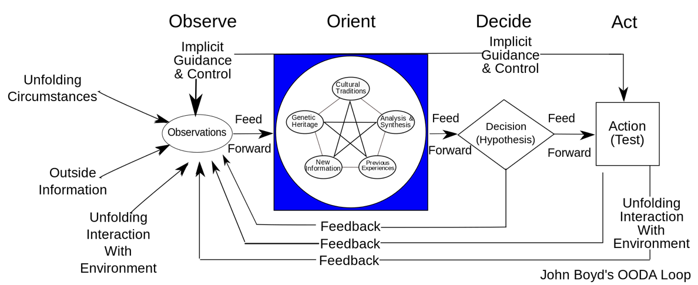
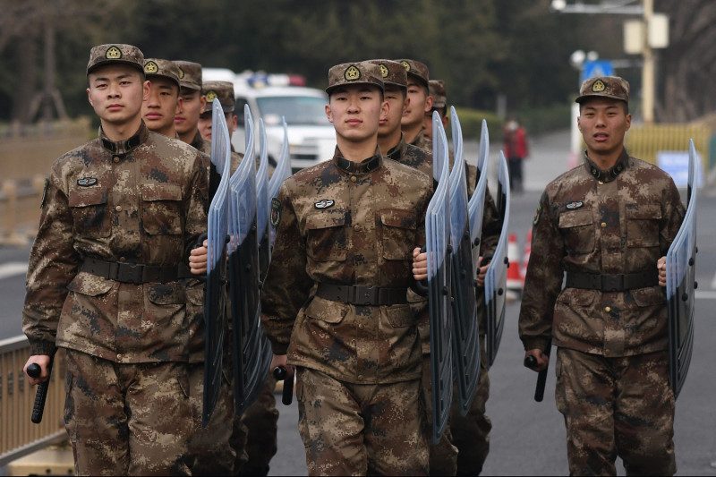
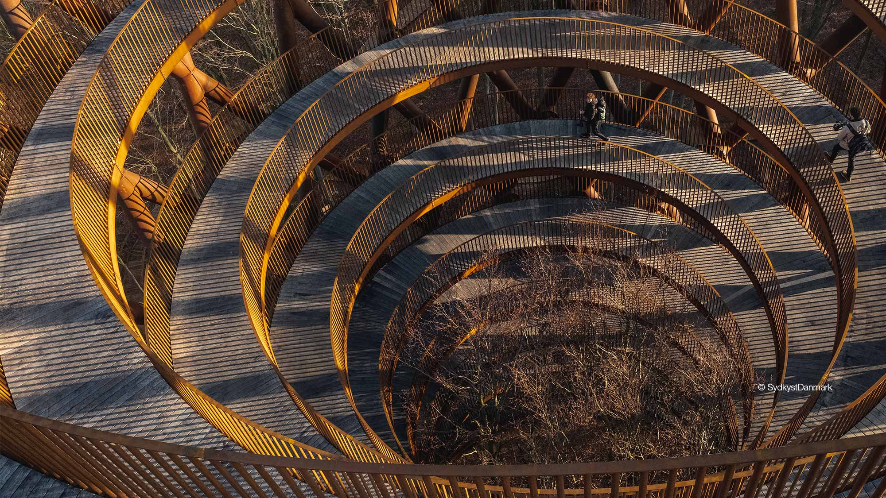

<main credit="Ant Farm" quote="Boyd closed the briefing by saying the message is that whoever can handle the quickest rate of change is the one who survives. — Robert Coram on John Boyd">

Hi.

**Design is a cyclical action.** While individual artifacts are ejected from the process (like this newsletter and its upcoming visual redesign), the actual process of design is something ongoing.

Throughout my career, I’ve wrestled with the fundamentally commercial nature of design output. We live in a capitalist society, and must create something that someone else sees as being of value to be rewarded within that system. As this system too is cyclical, our reward is fed back into the system to reward others for their production of something that we value. This is the most simplistic of frames, but a good place to start. I quite like how Donella Meadows framed these systems in her book [Thinking in Systems: A primer](https://amzn.to/2UodGbs).

Design process and ones evolution as a designer manifests in almost the exact same way, but with memory. As designers, we are driven to create artefacts of some value to others. We engage in a cyclical process to create these artefacts and then “freeze” the process in time (as a manufactured object, as a defined version of code, as printed material, as an executed experience) to reflect our understanding of maximized value to the consumer. Then, we either start working on the next version if we’re product focused, the next aspect of the experience if we’re service focused, or something else entirely if we’re consultants.

But in the process of creating that output, our experience as designers has been altered. By designing something, you engage in a cyclical process of orienting a designed thing alongside the needs and values of a consumer (so you can be rewarded for that thing with capital somehow). What that means is that you situate your process as a designer alongside a market demand, and your process — your identity as a creator — is altered to better adhere to that market. In many ways, you come to be a reflector of those market needs and demands when engaging in design process.

**This reflection collectively impoverishes the discipline of design.** By unconsciously aligning our identities with the demands of a capitalist economy, we serve to limit the scope of what might be created by lieu of that allegiance. In my own market-focused product, Knowsi, I struggle with this immensely. The strategic goal of this tool is to alter the behaviours of researchers, so that protecting the privacy rights of their research participants is EASIER than not protecting them. For me, it is more valuable to design a tool that represents my own values around privacy, but for the consumer, it is more valuable to have a tool that maximizes their power in the researcher/participant consent relationship.

We see this tension of value everywhere. Today, one of the most intensive debates is around the overreach of the FAANG software companies and their approach to privacy. In his book [Platform Capitalism](https://amzn.to/2wJ0Hbi), Nick Srnicek points out that “if these platforms wish to remain competitive, they must intensify their extraction, analysis, and control of data — and they must invest in the fixed capital to do so.” **Designers of these platforms are faced with a potentially excruciating choice: engage with the individual value set of their own design process — one which might value privacy, or one which emphasizes restraint, or one which celebrates sustainability — or engage with the incredibly tangible value set of the market — valuing competitiveness, defensible assets and property, and relative market share.** This choice is often not as hard as one might think, as we are all often hundreds and thousands of individual design decisions down the path of the market’s frame on value.

So how does one escape this? I actually don’t know that you can. Here are two examples of lock-in: one positive; one negative.

A product that I’ve really admired over the past bit is [Solar Sack](https://solarsack.com/), a startup from Denmark’s Innofounder program of which led design mentorship in 2018 and 2019. Solar Sack is a brilliantly designed product. It’s a mechanism to heat water using only solar energy, and it’s cheap, durable, and easy to use. Its customer base is rural Africans in need of a cheaper and more sustainable alternative to burning fuel for heat and purify water. It has a sustainable and profitable business model that isn’t extractive to its customer base, and vitally, the value system of its designer Andreas aligns brilliantly with the value his customers receive from the product. But Alexander has been working on this thing for years. The product emerged from his masters in industrial design, and before that, he had spent time in Kenya working and volunteering. The product itself was vitally co-designed with its users: with Alexander taking multiple extended trips across Africa to work with his potential customers. As such, by the time Solar Sack hit the market, he had been through countless cycles of a design process that oriented his values toward those of his customers, and facilitated the emergence of this product.

Take an alternative, far larger, and far more tragic example: the US failure to aid and rebuild in Afghanistan. Between the invasion in 2001 and 2016, [the United States spent more money attempting to rebuild Afghanistan than it spent rebuilding Europe in the wake of World War II](https://www.vox.com/2016/2/26/11116874/afghanistan-failure). And yet now in 2020, the Trump administration is in peace negotiations with the Taliban, attempting to retreat from the marginal gains in civil liberty and governance that have been made. With the caveat that any commentary on this failure is both subjective and incredibly generalizing to such a wickedly complex problem, I would make the argument that the challenge lies in a deep misalignment between the value system of the designing entity (the US-led coalition) and what is VALUED by those receiving the aid. Access to capital, development projects, education, and political enfranchisement are certainly great things on the surface, but on what terms? And for whom? In his 2013 article Money Pit, Joel Brinkley recounts examples of failures from the US development in Afghanistan. As the US DOD Government Accountability Office put it, “we noted that without an adequate number of trained oversight personnel, DoD could not be assured that contractors could meet contract requirements efficiently and effectively.” This resulted in such memorable mistakes as a dining hall without a kitchen, a shower facility without plumbing, and a forward operating base built so flimsily, its staircases were a greater threat to US personnel than the Taliban.

The issue of oversight in this case is **a failure to receive feedback from ones market**. If the goal of US aid in Afghanistan is to replicate the modality of reconstruction that Europe saw following World War II through the Marshall Plan, then the necessity of feedback is all the greater. As mentioned in the [quote section of last week’s newsletter](https://divergeweekly.com/issue/3/), free market economies thrive on the dissemination and aggregation of information in common pools. The stock market, for example, is believed to be an invaluable aggregator of sentiment and mood within an economy. By the same token, the synthesis of a dozen users interviewed is believed to be a vital aggregation of your customer’s needs and intent. Across the myriad ways that the US aid program in Afghanistan differed from the Marshall plan, those feedback mechanisms are primary. Without effective feedback, how could the US government and its many agencies possibly get to a model of development that reflected the real needs of the Afghan people? And perhaps more fundamentally, is it even possible for an occupying power to provide for those needs given the gap in the occupying power’s value system, and the definition of value held by those occupied?

**Design is a cyclical and continuous action. We constantly reflect back our observations and actions in the world, and incrementally re-orient our world views over time.** Perhaps my favourite articulation of this is John Boyd’s diagram of the OODA loop, but instead of the microsecond articulation of that loop that Boyd envisioned in arial combat, I imagine it as spread across the entirety of ones life as a designer.

Alexander’s Solar Sack is an output of years of iteration leading him to the creation of that design and that business. The US aid mission in Afghanistan is an output of decades of iteration across hundreds of organizations and thousands of people that locked it into a particular belief about how to accomplish that mission.

I believe that **the frontier of contemporary design is to find the tools to break out of our shared path dependence.** Individually and collectively, we’ve become trapped by our own processes, and we need a way out.

To that end, looking at the sudden shift in value that we’re seeing in the wake of Covid-19, I wonder if perhaps now is the time to question everything. I don’t know that the business model canvas will save us, if only because it presupposes a particular flow of production and value. I don’t really believe that offering “free consulting hours” will help us, especially if consulting around a paradigm that left us this fragile. I think we need to change and look outside of what we thought worked, and I know that won’t be easy.

But right now, trapped as we are between a brittle past and an uncertain future (probably in our homes, possibly with loud neighbours), what better time to turn the cyclical motion of design in on ourselves, and perhaps shake free of the grooves we’ve found ourselves in?

As always, [please subscribe to and share Diverge Weekly](https://divergeweekly.com) if you haven’t and [send me a note](mailto:alb@andrewlb.com) if you have questions or feedback!

</main>

<region>

[[region | East Asia]]
|[Tomomi Kito remodels Tokyo home to accommodate four generations of the same family](https://www.dezeen.com/2017/07/01/remodelled-tokyo-home-4-generations-same-family-architecture-residential-japan-multi-generational-homes/)
|Design is a cyclical action, especially in its capacity to generate culture and tradition. Our home is perhaps the most fundamental tool in a shared experience, and to design one intentionally around multiple generations is both a brave and incredibly prescient decision, given how close family structures might help us weather the uncertainty ahead of us.

[[region | South Asia]]
|[India tracks attendees after Muslim event linked to virus cases](https://www.aljazeera.com/news/2020/03/india-links-dozens-coronavirus-cases-muslim-gathering-200331095417048.html)
|Cycles can be destructive. The chipping away by populism and religious violence, the world’s largest democracy is straining under multiple stressors, and covid-19 is only the most recent. Looking at the anti-muslim rhetoric of the Modi administration, it is a major worry that this crisis will turn into a justification for increased surveillance and increased persecution. While many world leaders are finding their position tenuous in these times, most authoritarians will leverage emergency power in the coming weeks, months, and years to secure their position. The question is: can that impulse be controlled by democratic institutions and civil society?

[[region | Americas]]
|[The coronavirus outbreak won't peak in every state at once](https://www.axios.com/coronavirus-states-peak-hospitals-53274e0e-69b8-4dc7-b069-fb27955c559a.html)
|The last two issues of Diverge looked at this idea that a common event in time is experienced both subjectively and objectively in very different ways. In this case, we have an incredibly tangible model of how covid-19 will hit its peak in different states, at different points in time. As we saw in the UK (PM Johnson went from recommended herd immunity and handshaking the infected to self isolating) and an unending stream of exponential graphs, that interval between a considered-or-ignored threat and a deadly reality comes far too quickly.

[[region | MENA]]
|[Europe sends medical gear to Iran, bypassing US sanctions as coronavirus deaths rise](https://english.alaraby.co.uk/english/news/2020/3/31/europe-sends-medical-gear-to-iran-in-sanction-bypass-deal)
|Cycles can also be productive. The crippling (and unfortunately fairly innovative) sanctions placed on Iran by the United States are a substantive contributor to the current scale of the covid-19 crisis in Iran. While certainly not the only factor (Iranian government collectively showed up to work with a temperature of 45c and the statement "I feel fine. Is it hot in here?" on their lips), this push against the US sanction regime through a (somewhat) new transaction mode called INSTEX may serve not only as a diplomatic reset with Iran, but as an absolutely vital measure to save Iranian lives.

[[region | Africa]]
|[Somalia sending 20 doctors to help Italy fight virus](https://www.aa.com.tr/en/africa/somalia-sending-20-doctors-to-help-italy-fight-virus/1782154)
|In a world of deep but variate mutual dependence, we should watch for the cycles of stasis or change around the world. African nations are responding to the crisis in different ways and keeping an eye to the shifting power structures between the US and China, partially by pushing against the tired stereotype of being only recipients of aid rather than active participants in a global community. Because our experience of now is by definition only fodder for future iteration, these power dynamics and responses paint a picture of where we’ll be tomorrow.

[[region | Europe]]
|[Has the World Learned the Lessons of the 2015 Refugee Crisis?](https://www.worldpoliticsreview.com/articles/28644/has-the-world-learned-the-lessons-of-the-2015-refugee-crisis)
|Framed by the current coronavirus crisis, this article explores the collective action problem of mass migration and what we have apparently failed to learn in its systemic effects. As Dona Meadows demonstrates, while events may differ on the surface, their underlying systemic mechanics might actually be quite similar. I found this to be a useful read given how the European Union has been approaching the virus and its most affected member states, both to consider consistencies in response and in how this virus will multiply the strain already felt by the EU.

</region>

<security credit="Greg Barker">

[China’s Military Claims to Be Virus-Free](https://foreignpolicy.com/2020/03/20/pla-coronavirus-invasion-chinas-military-claims-to-be-virus-free/)

[DoD isolating critical troops and commanders to be ready in a crisis amid pandemic](https://edition.cnn.com/2020/03/30/politics/us-military-special-protection-measures-coronavirus/index.html)

The contrast in how the militaries of great powers are engaging with the coronavirus is stunning. Whereas China is taking the official stance that there are no active infections in the People’s Liberation Army (PLA), the US military is being both open and proactive in engaging with the threat. Unfortunately, the nature of military service is close proximity and frequent rotations, so it is inevitable that a substantive portion of the uniformed service of both countries will be infected.

The way this virus is reshaping our security landscape and relative strength is important to watch. With the US military reeling from nearly two decades of war, the sudden reality that the homeland is no sanctuary may come as a lasting shock. By the same token, just as President Xi was dealt a major political blow when his administration failed to cover up the Wuhan outbreak, President Trump is facing the same for his unwillingness and inability to enact any meaningful preparation as the chief executive. With that, both leaders have now turned to blaming the others for what is effectively a risk that was inevitable: whether it emerged from a Chinese wet market, an American farm, a Brazilian forestry site, or an African mining operation. These cycles of blame and escalation are incredibly dangerous, and it’s these types of cycles and feedback loops which we need to watch as closely as the immediate effects of our current pandemic and economic crisis.

</security>

<jobs>

[[jobad | User Research in Ethiopia]]
|[Contract User Researcher, Simple.org](https://groups.google.com/forum/embed/?place=forum/design-gigs-for-good&showsearch=true&showpopout=true&showtabs=false&parenturl=https%3A%2F%2Fwww.designgigsforgood.org%2Fjob-board#!topic/design-gigs-for-good/ssVm3KilpSA)
|Located in Ethiopia
|
|This would be an awesome opportunity for a user researcher interested in global health and based in Ethiopia. While it looks like the role might mostly be targeted at locals, there may also be room for someone with experience doing research work in Africa more generally.

[[jobad | Education and Innovation]]
|[Education Research & Innovation Lead, International Rescue Committee](https://rescue.csod.com/ats/careersite/JobDetails.aspx?site=1&id=8360)
|Located in New York, USA
|
|I have a not so secret crush on the IRC and their design work. This role would have you working with the Airbel Impact Lab to develop solutions for people impacted by conflict and disaster, with a focus on children. It's a high impact role and probably a great one for someone with strong design education and co-creation experience.

</jobs>

<sponsor image="https://www.knowsi.com/static/tier1.png">

## Knowsi

Knowsi manages consent for user research. Send and track participant consent with custom forms and GDPR-focused tools.

[Join Knowsi today for free!](https://knowsi.com)

</sponsor>

<image credit="EFFEKT and Arup" link="https://www.arup.com/projects/camp-adventure-tower">

The Danish Camp Adventure Observation Tower is an incredible structure and one that is standing disquietingly still right now. Architecture like this is all throughout Scandinavia: stark and meditative, it serves to take you out of place for a moment and — per the theme of this issue — helps you to reset. Somewhat. If you find yourself in Denmark and the quarantine has lifted, I encourage you to give it a visit.

</image>

<voices who="Philippe Beaulieu-Brossard" role="Co-Director, Archipelago of Design" image="img/phillipe.jpg">

How is design thinking impacting the special forces in the US, Denmark, and Canada? That was the context where I met Philippe, who was participating in a panel on Design Thinking in the Military. While I am a bit of a design thinking skeptic, this contemporary exploration of design practice by military theorists and practitioners is worth our attention.

Philippe and his peers are creating a synthesis around modalities of thought, learning, and practice in the design high-autonomy teams and high-stake outcomes. His work and the work of his peers is helping me reframe my own understanding of design, so expect to see more of this type of thing shared in future issues.

In Philippe's words: "We use design thinking as an umbrella term to make things easier with military organizations. We dig more deeply into a philosophical and methodological assemblage including American pragmatism, system theory, design theory, strategic design, foresight, organization theory, complexity theory, post structuralism, and operational art to name a few."

[The Archipelago of Design: Reflexive Military Practice](http://militaryepistemology.com/)

</voices>

<twitter who="svg">

[Who led the digital transformation in your company? a) CEO b) CTO c) Covid 19](https://twitter.com/svg/status/1244540212866400256)

</twitter>
