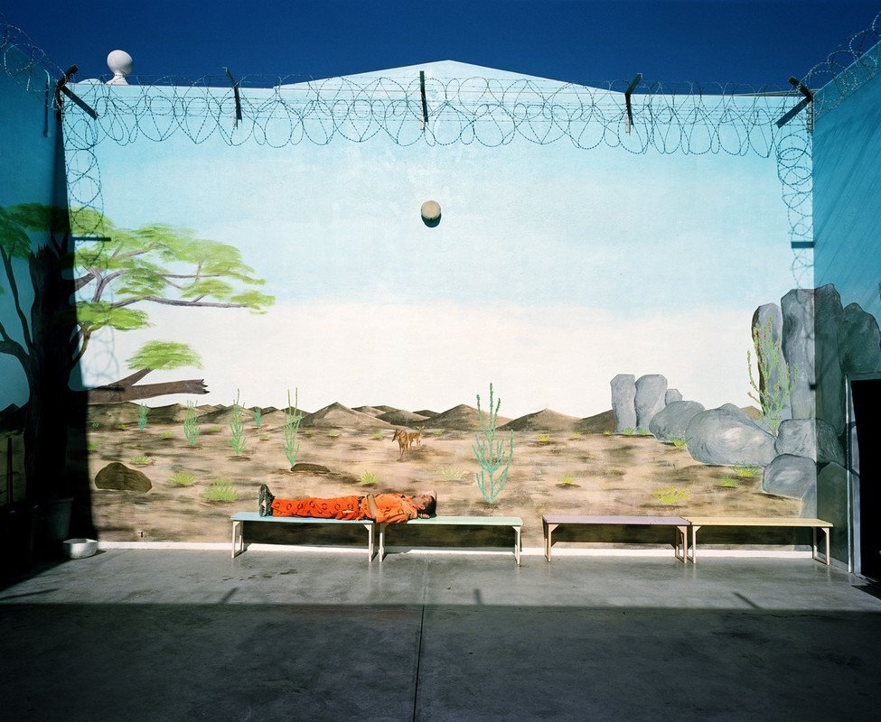
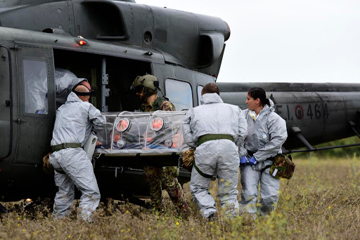
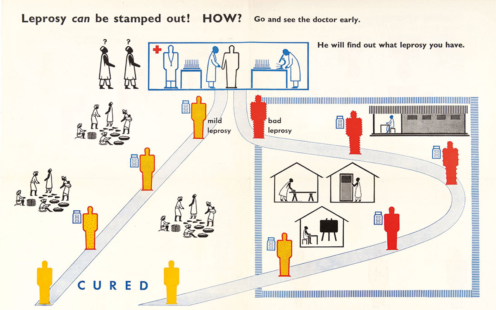

<main credit="Mikhael Subotzky" quote="I don't know where my expertise is; my expertise is no disciplines. I would recommend to drop disciplinarity wherever one can. - Heinz Von Foerster (1995)">

Hi all,

We’re going to try something a little bit different this week and reflect a bit about this project and its goals. This is issue #5 (including a prototype issue 0 which no one saw), so it felt like time to take stock.

## What is this Newsletter?

I’m still trying to figure out what this newsletter is meant to be and where its identity lies. The current subtitle of the site is: _Every Wednesday, a look at design and designers through the lens of global affairs to inform, inspire, and activate._ This tagline is going to change a fair bit as the site changes, of course, but it does do a good job addressing what I want to accomplish:

1. **To use design practice and discourse as a lens to engage with global affairs** — from conflicts, to supply chains, to our current global pandemic. I’m also trying to focus on the work of design, asking what products, services, insights, and experiences are generated through design practice and where we are seeing that in international events.

2. **To funnel critical international relations theory and practice INTO the domain of design practice.** I’m currently doing a masters in International Security Studies, so this is very much something I’m discovering. I’m not quite sure what this looks like yet, but one of the ways I’ve been trying to do it is through the “Happenings” section, which looks at regional news, highlights non-western (though ultimately usually still English language) news sources, and contextualizes that news around the weekly topic.

3. **To highlight the different ways that design manifests around the world, ESPECIALLY where it doesn’t get framed as design.** IR scholar Cynthia Enloe suggests that _“Making feminist sense of international politics requires that you exercise genuine curiosity about each of these women’s lives—and the lives of women you have yet to think about.”_ I believe that this person-centric lens on the international is the most meaningful entry-point for designers, and perhaps one that should be most familiar to designers. Engaging with the question of who does the “invisible work” of global affairs becomes a foundation for considering how design can have impact. I'm interested in looking past the often homogenous cliques of world leaders, looking at why power dynamics are the way they are, and looking to the individuals and groups engaged in those systems.

### Informing

My goal here is to highlight news that you might not see if you weren’t looking for it. I consume a lot of news, and I recall when I was living in the states, most of that news was caught up in American federal politics. Since moving to Copenhagen, I’m still pretty wrapped up in American politics to be honest, but I’ve also been following a lot more news from the Middle East (I’m learning Arabic), from China and East Asia out of interest, from Africa as part of my masters and startup mentorship activities (that part is a bit random), and of course, lots and lots of European sources.

I don’t think you need to consume all of that. I probably shouldn’t. But as there’s a topic each week, I think the exercise of reflecting on that topic through the lens of these articles (primarily in the Happenings and Security Blanket sections) helps flush out the argument and gives you a starting point to structure your own view.

### Inspiring

My perspective on all this is shaped by the designers and thinkers I’ve had the good fortune to work with, not to mention the near-unlimited access to the process stories of incredible design work from around the world. In the Design Voices, Feature, and ultimately this main writeup, I’m hoping to bridge design practice to the global in a meaningful way, and set the example of how individuals and groups are already engaging in this work.

### Activating

Finally, this is where I’m going to be developing this newsletter as I would develop an application. I want to use this platform as a way to create tools that help people get involved. Right now, that just looks like the job postings I share each week. But I’m also writing how-to guides and resources for preparing for international work and jobs, as well as personal design tools (like the [Covid Anxiety forecasting game]( my wife and I made) my wife and I made) that will help bring a level of focus to that work.

So. There is a lot going on here, and already from starting 6-7 weeks ago on this project, my perspective is changing and narrowing in quite a bit. Fundamentally though, **I want to thank you for subscribing early and helping me get this going.** It means a lot. Most of you are friends or former colleagues, some of you found your way here from my design research and consent app, [Knowsi](https://knowsi.com), and some of you just found your way here some other way. But I’m super grateful that you’re here. Also, if you want to give me any feedback (some of you have filled this out already), [I have a small feedback form I sent out in Issue 3 which is still open](https://andrewlb.typeform.com/to/AGyImr).

# Redesigns?

You might also notice that the newsletter and DivergeWeekly.com site have the beginnings of a redesign. The first version of the newsletter came together in January in two or three days. It’s a heavily DIY project. As a quick intro: I wrote the newsletter generator using GatsbyJS, a static website/blog tool I use for my website andrewlb.com. I modified it pretty heavily so that in additional to creating a static site (hosted on GitHub), it also generates the files for the newsletter, and uploads it to my self-hosted newsletter application, Sendy.co.

From there, each week I write this newsletter in Markdown, compile it using the special format that I developed, make sure everything is in place, and hit send.

The first site didn’t have any visual design applied to it. This next version will have a fair bit more, and I’m hoping to get some help from someone with better visual design chops to develop the brand and layout a bit. However, what you’re seeing is the first step, and you can expect more changes in format and visuals to come along.

Additionally, I’m working on changing up the data model a bit so that it’ll be easier to see the Design Voices, News, and perhaps most important, jobs in a single place. That won’t happen immediately (this is a late night passion project), but expect to see that coming up.

Finally, I mentioned the how-to guides and similar. I’m going to be interviewing other designers with international work experience both on the consulting and employment side of things in the weeks to come. So if you know anyone who fits that bill, [please let me know, as I’d love to chat](mailto:alb@andrewlb.com).

Thank you again for subscribing to Diverge! I love writing this, and I’ve been incredibly grateful for those who have helped. In particular, [Ayla Newhouse](http://www.aylanewhousedesign.com/), [Scott Young](https://twitter.com/scottalyoung), [Zahra Ebrahim](https://twitter.com/zahraeb), [Kai Brach](https://www.brizk.com/) and [Michael Schwanzer](https://www.zeitdice.com/) to name a few.

As always, [please subscribe to and share Diverge Weekly](https://divergeweekly.com) if you haven’t and [send me a note](mailto:alb@andrewlb.com) if you have questions or feedback!

</main>

<region>

[[region | East Asia]]
|[The SARS epidemic and its aftermath in China: a political perspective](https://www.ncbi.nlm.nih.gov/books/NBK92479/)
|SARS scared the hell out of a lot of people. Right now, many are questioning why SARS was ignored by most nations, given its potential as a strong signal for what we might expect in the future: not the same but reflective. Written in 2004, I found this article to be interesting for its "near term" look at the impact SARS had on China. Ultimately, it suggests that the political pressure that the disease was putting on elites was a primary motivator in mobilizing intervention. The question is: how can we tighten the feedback loop between political pressure and elite action to combat such crises before things go too far astray?

[[region | South Asia]]
|[Singapore is the model for how to handle the coronavirus](https://www.technologyreview.com/s/615353/singapore-is-the-model-for-how-to-handle-the-coronavirus/)
|Different political systems have been responding to covid-19 differently. Singapore in particular has emerged as handling the crisis with alacrity — rapidly mobilizing to track its spread and leveraging intensive surveillance measures to keep new cases in check. This type of response is difficult to manage outside of strong centralized governments, as we're seeing with the different state-based responses in the United States in the face of Presidential ineptitude. As more countries are looking to the success stories of Covid-19, the onus will be on designers and engineers in implementing what will likely be an increased demand for surveillance, and perhaps one coming from the citizenry itself.

[[region | Americas]]
|[Why is the world so poorly prepared for a pandemic of hypervirulent avian influenza?](https://www.tandfonline.com/doi/full/10.1080/08910600600866544?scroll=top&needAccess=true&)
|Another reflection on SARS only barely in the rear-view mirror — this 2006 article asks why we were (and are) so poorly prepared for a pandemic. A central argument is that infectious disease must be reframed as a vital security issue — internationally, regionally, domestically — in order to both prepare as we do for militarized conflict, and to appropriately leverage alliances is combatting a spreading infection. By securitizing the disease (yes, securitize is a word, at least as far as the Copenhagen school is concerned), the scope of potential actions and outcomes changes. I think this capacity to reframe is a helpful lens for designers when engaging challenges that often seem insurmountable; plus this article is just an interesting read for where we find ourselves today.

[[region | MENA]]
|[90 Years Could Pass Before We Learn the Lessons of Israel's Coronavirus Crisis](https://www.haaretz.com/israel-news/.premium-90-years-could-pass-before-we-learn-the-lessons-of-israel-s-coronavirus-crisis-1.8734477?=&ts=_1586296667077)
|Sometimes, introspection comes too late. The safest way to consider global pandemics is to just assume that one will happen eventually. Israel has an incredibly well developed intelligence community and a political community tightly coupled to the military, and there is a certain (arguably reasonable) default towards sealing things for the future (the incredible book Rise and Kill First being a testament to that). But this article presents some interesting arguments for why certain defaults around secrecy need to be reconsidered with a lens towards collective health and introspection.

[[region | Africa]]
|[Crowd in Ivory Coast destroys coronavirus testing centre in residential area](https://www.france24.com/en/20200406-crowd-in-ivory-coast-destroys-coronavirus-testing-centre)
|The most terrifying thing about this virus is how it turns demographic groups against each other. The young a threat to the old, people from one city are shunned, and in the west in particular — a flood of racism against Asians and the symbols of sickness (face masks, coughing, etc.) A fascinating corollary to this is violent response to the vital infrastructure of responding to a pandemic, as described in this article. This is where good communication design and service design could play a vital role, shifting the negative association with state over-reach towards one of support and safety.

[[region | Europe]]
|[Chernobyl’s on Fire. Great.](https://www.vice.com/en_us/article/n7jga7/chernobl-fire-radiation)
|While this seems somewhat minor relative to a global pandemic, I just wanted to include it here as a reminder of how these risks and events compound. Every system has its breaking point, and while we can adapt to a lot, there'll be a certain point where things start to fall apart. I'll admit that my biggest long-term fear with Covid-19 is that resilience within our systems will be consistently weaker, simply because we don't know when a wave of infection might hit critical personnel, or we have to limit response size to balance risk and capacity for healthcare providers. What happens to forest fire crews or military basic training? So look for these small cracks. I think we'll be seeing more.

</region>

<security credit="">

[US cast as culprit in global scrum over coronavirus supplies](https://www.politico.eu/article/coronavirus-united-states-cast-as-culprit-in-global-scrum-over-supplies/)

One of the most striking things about the Covid-19 pandemic has been the surge in protectionist measures that different countries have taken. It makes sense. The generous argument is that a country manages its own crises, and then is able to open up to help its allies. Sitting here in Denmark as we're beginning to loosen restrictions, I'm watching the Danish relationship with the much more at-risk Sweden around that particular theory.

But then there's the more realist view that this was inevitably going to be the response — that state structures hold primacy, and that the state places its own power and security over all other things. What we've seen so far certainly can be seen as supporting that view. Countries are desperately competing for supplies, with the US leveraging its incredible wealth to push many of its allies around — most recently with the supposed hijacking of a personal protective equipment shipment to Germany.

</security>

<jobs>

[[jobad | Data Storytelling in Hong Kong ]]
|[Graphics and Data Journalist, Bloomberg](https://careers.bloomberg.com/job/detail/81743)
|Located in Hong Kong
|
|This looks like a pretty awesome data and visual storytelling role with a good technical piece thrown into the mix. You'd be working with the Bloomberg News Graphics Team, and definitely involved in the newsroom scrum. If you're currently in a product role and looking for something faster pace, this might be a really incredible experience.

[[jobad | Journalism Fellowship in Europe]]
|[Google News Initiative Fellowship](https://journalismfellowships.eu/)
|Located in European Countries
|
|This looks like an incredible bridge from either an existing design career or a journalism-oriented degree into the newsroom. Taking place across a number of countries within Europe, it's an 8 week funded fellowship program taking place this summer.

</jobs>

<sponsor image="https://www.knowsi.com/static/tier1.png">

## Knowsi

Knowsi manages consent for user research. Send and track participant consent with custom forms and GDPR-focused tools.

[Join Knowsi today for free!](https://knowsi.com)

</sponsor>

<image credit=" " link="https://eyeondesign.aiga.org/what-role-does-design-play-in-a-public-health-crisis/?ref=reallygoodemails">

Crop from Leprosy poster-leaflet, 1955, Otto and Marie Neurath Isotype Collection, University of Reading

This excellent article on AIGA's magazine, Eye on Design, provides some examples of how (specifically communication and service) design has an incredibly impactful role to play in communication around public health. As we're seeing with the current crisis, so much of what we believe about this pandemic — whether it comes to masks, herd immunity, or ones own risk profile — comes down to what we glean from the information around us.

</image>

<voices who="Chris Wronski" role="Design Lead, Fjord Copenhagen" image="img/wronski.jpeg">

I first met Chris in San Francisco when he was working with Adaptive Path, and later re-connected with him in Copenhagen where he works with my wife at Fjord. Holding both American and Polish citizenship, Chris was able to travel quite easily within the EU, and has used that border-flexibility to travel quite broadly. Whether it's bike-packing trips from Denmark to Norway, traveling to Sweden to interview Syrian refugees for an upcoming film he's supporting, or carefully documented motorcycle trips across Italy — Chris brings artful communication and storytelling into everything he does.

[The Wronski](http://thewronski.com/)

</voices>

<twitter who="LibyaLiberty">

[I was talking about something with my daughter who's in high school, and she shared some ideas that she said she "saw in a documentary recently. well, it was more of a tik tok." a. documentary.](https://twitter.com/LibyaLiberty/status/1247561924621012992)

</twitter>
