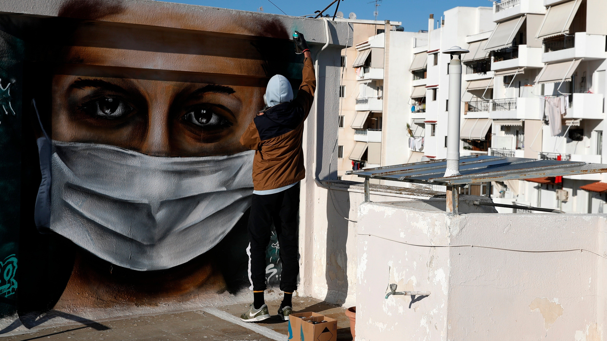
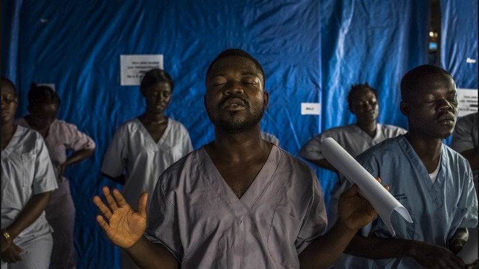

<main credit="AP Photo/Thanassis Stavrakis" quote="The future is unwritten. there are best case scenarios. There are worst-case scenarios. both of them are great fun to write about if you’re a science fiction novelist, but neither of them ever happens in the real world. What happens in the real world is always a sideways-case scenario. World-changing marvels to us, are only wallpaper to our children.
― Bruce Sterling">

Hi all,

This will be a quick one relative to some of the essays I’ve been writing recently.

I’ve been reading and thinking about foresight — especially as it relates to the current pandemic and security. As a result, I’ve been getting interested in why we believe what we believe about the future.

With the rise of platform empires, we’ve effectively [ceded the original vision of the internet as a distributed space](https://anildash.com/2012/12/13/the_web_we_lost/). Battle after battle of the free internet was lost to convenience, monetization strategies that drove consolidation, and **the pens, mice, and post-its of designers locked in market-driven competition**. Some of the most interesting conversations one can have on this are with Facebook designers who are both critical thinkers (which applies to many of those I’ve met) and who are anxious about the impact of what they’ve helped create. Yet they find themselves captured through unvested stock, individual loyalties within their teams, and the completely legitimate hypothesis that they might be able to make things better.

I don’t really know the answer on this one. [We’re all culpable for the internet that we lost](https://thenextweb.com/eu/2017/06/09/pirate-bay-founder-weve-lost-the-internet-its-all-about-damage-control-now/), and there’s some very good designers at the platform giants — good in skill and good in soul — who we shouldn’t throw under the bus. But I do think there’s a meaningful discussion to be had around this idea of capture and recognizing when we ARE captured.

I read an article recently by Patrick Porter on [how the British national security apparatus undermined its own foresight efforts by unconsciously insisting on confidence in their capacity to handle whatever might come](https://www.cambridge.org/core/journals/european-journal-of-international-security/article/taking-uncertainty-seriously-classical-realism-and-national-security/1022E6B6D12A8902E7F40B575D01C40B). This very idea is pathological: that they might both acknowledge the magnitude of the unknowns they face, and still require confidence that they can wrangle it given our current preparedness. Britain isn’t alone in this, of course. If you’re developing a product, you’ll experience microcosms of this every day: the feature or design decision you made just doesn’t glom on to reality. Your user or customer is frustrated, their user or customers are confused — all because your synthesis of their needs and your own sensibility missed its mark. The difference lies in the speed of iteration.

A designer can (usually) quite easily test their hypothesis. Find a customer, set up a prototype, launch a test, or simply watch how your (possibly socially distanced) neighbour interacts with it. But of course that’s not so easy for a state’s national security establishment. Usually, national security institutions are pretty brilliant when it comes to punching through their own biases, using tools like [red teaming](https://en.wikipedia.org/wiki/Red_team) and others to explore alternative scenarios. But as [Micah Zenko’s book on Red Teaming points out](https://amzn.to/3aaWM4X), the role of the Red Team can often be institutionally undermined in subtle ways: [be it explicitly walking back a decision during a war game](https://warontherocks.com/2015/11/millennium-challenge-the-real-story-of-a-corrupted-military-exercise-and-its-legacy/) or [tacitly signalling leadership’s dissatisfaction with the results](https://foreignpolicy.com/2016/01/07/red-team-a-tale-of-how-a-general-didnt-listen-to-internal-criticism-in-afghanistan/). In both cases, the act of simulating alternative options — of diverging from the current mode of thought — becomes dramatically constrained by the needs and fears of the commissioning institutions. It’s effectively nullified.

I think the same thing happens to the sensibility of designers captured by institutions. The scope of potential divergence becomes naturally constrained by the needs of the institutions they serve, and so their sensibility [is reinforced and narrowed along those lines over time](https://divergeweekly.com/issue/4/). And I think this is part of what I want Diverge Weekly to combat. This idea of capture is a reflection of a point in time for an individual or a class of designers where the aperture is narrowing. But I’d like to believe it can still be opened.

So if the intent is to widen that aperture, functionally how do we start to open it again?

That’ll be for future issues.

As always, [please subscribe to and share Diverge Weekly](https://divergeweekly.com) if you haven’t and [send me a note](mailto:alb@andrewlb.com) if you have questions or feedback!

</main>

<region>

[[region | East Asia]]
|[In Rural Japan, a 370-Year-Old Tradition Falls to One Child - The New York Times](https://www.nytimes.com/2020/04/13/world/asia/kabuki-japan-children.html?referringSource=articleShare)
|A sad and very thoughtful essay on a fading tradition which forces us to ask WHY we fight so hard for some of the traditions we've adopted.

[[region | South Asia]]
|[Exploring Foresight, Epidemiology and the Coronavirus Pandemic with Dr. Peter Black](https://jfsdigital.org/2020/04/07/exploring-foresight-epidemiology-and-the-coronavirus-pandemic-with-dr-peter-black/)
|Dr. Black is an epidemiologist and foresight specialist with experience working around south east Asia. He has a different take from what I've often heard: that our current response is just about as good as it could have been on a macro level. This perspective is noticeably different from the critique in the US.

[[region | Americas]]
|[He Could Have Seen What Was Coming: Behind Trump’s Failure on the Virus](https://www.nytimes.com/2020/04/11/us/politics/coronavirus-trump-response.html?referringSource=articleShare)
|This is a stunning set of reporting around President Trump's response to the Coronavirus, both as the virus grew in scale and before with a systematic dismantling of America's protective measures. A must read in considering the US response.

[[region | MENA]]
|[The third wave of the coronavirus pandemic is now - The Boston Globe](https://www.bostonglobe.com/2020/04/14/opinion/third-wave-coronavirus-pandemic-is-now/)
|Written by a friend from my time at New America, Sharon Burke is a former assistant SecDef, deep thinker on systems, and student of the middle east. She takes a broad look at fragility around the world in this op-ed, and emphasizes the pointlessness of staying on a path that we've already seen doesn't work.

[[region | Europe]]
|[Developing pandemic preparedness in Europe in the 21st century: experience, evolution and next steps](https://www.ncbi.nlm.nih.gov/pmc/articles/PMC3324872/)
|I've been poking through articles like this recently, and found this one to be interesting for its description of war-gaming pandemic response in a regional context. Living in Denmark now, it's been fascinating to see how different countries within the EU are responding, and while the war game described here is certainly a rosy lens, I suspect it had an influence on widening the aperture.

</region>

<security credit="">

[Millennium Challenge: The Real Story of a Corrupted Military Exercise and its Legacy](https://warontherocks.com/2015/11/millennium-challenge-the-real-story-of-a-corrupted-military-exercise-and-its-legacy/)

I'm not going to talk too much about this, beyond recommending giving it a full read. I mentioned some of it at the start of the newsletter, but these kinds of true tales of institutional capture unfortunately cost lives and end careers — and not always that of the negligent party. The capture can be summed up in this section: "JFCOM and the Office of the Secretary of Defense were determined to validate the principles and concepts that would support the advanced technological military transformation that Rumsfeld and his senior aides had been insisting upon."

Capture takes place over time, and capture takes place when ones priorities, values, and sensibilities are subsumed by another force. It also often happens to incredibly smart, talented, and dedicated people who could know better, but whose scope of potential futures have narrowed.

</security>

<jobs>

[[jobad | Business Design in China]]
|[Frog Strategist in Shanghai](https://www.frogdesign.com/careers/jobs/1993014)
|Located in Shanghai
|
|Awesome job for a design-minded business person or a recent MBA grad with Chinese language skills. Frog does incredible work and attracts incredible talent, so I've zero doubt that working with their teams in Shanghai would be an absolutely unreal experience.

[[jobad | Human Centered Immigration]]
|[Human Centered Design at US Citizen and Immigration Services](https://www.usajobs.gov/GetJob/ViewDetails/565188500)
|Located in Washington DC
|
|This is a GS14 (so pretty high up) civil servant position with the Department of Homeland Security's Citizen and Immigration Services. There's a lot of justifiably strong feelings about DHS, but it's important to remember that DHS is a hodgepodge of different agencies bundled together after 9/11, and while it does include the much reviled Immigration and Customs Enforcement (ICE) teams who have been negatively empowered in the current administration, it also includes the coast guard and USCIS. I'd encourage exploring this option and seeing what change you can make inside. Don't hesitate to send me a note at alb@andrewlb.com if this is of interest, and I can try to help you navigate the application.

</jobs>

<sponsor image="https://www.knowsi.com/static/tier1.png">

## Knowsi

Knowsi manages consent for user research. Send and track participant consent with custom forms and GDPR-focused tools.

[Join Knowsi today for free!](https://knowsi.com)

</sponsor>

<image credit="Daniel Berehulak" link="https://lens.blogs.nytimes.com/2015/04/20/daniel-berehulak-the-ebola-crisis-earn-photography-pulitzer/">

**Daniel Berehulak**'s photography from the West African Ebola Crisis of 2014 won the Pullitzer prize, and captured an horrifying regional crisis. I’ve been both reading more broadly but also searching for photography of the current pandemic trying to wrap my head around the chaos others are experiencing relative to the calm (save for a wonderful but berserk 1yr old) of my day-to-day in Denmark. I’d seen Berehulak’s photos before, but spent some more time with them while writing this. [Please give them a look here ](https://lens.blogs.nytimes.com/2015/04/20/daniel-berehulak-the-ebola-crisis-earn-photography-pulitzer/)
(Warning, they are difficult to see)
</image>

<voices who="Julia Moisand-Egea" role="Head of Design, Nordea" image="img/julia.jpg">

Julia is an incredible design leader who I first met in San Francisco. Originally from France and married to an American, she worked with my wife, Ayla, at Adaptive Path before its acquisition in Capital One. She mentored and supported many emerging designers before and after that transition, and left an incredible legacy of support with that team. She’s also the catalyst for our ending up in Copenhagen, as she helped start the Fjord Copenhagen studio and quite effectively recruited Ayla to move to Europe in early 2017.

Julia is a model of what a global designer can be: someone with experience and empathy across cultures and language, co-designing a space for herself and her family where there are interesting problems and opportunities. I’ve been hugely inspired watching her cultivate design communities wherever she goes, and the fact that her team members will move around the world for the chance to work with her again is a testament to what great design leadership looks like.

[Julia on Linkedin](https://www.linkedin.com/in/julia-moisand-eg%C3%A9a-84824614/)

</voices>

<twitter who="CAFinUS">

[Every day is Tuesday, but today is Tuesday. Strength. Together-ish. #COVID19 #StayHome](https://twitter.com/CAFinUS/status/1250011429463298048)

</twitter>
