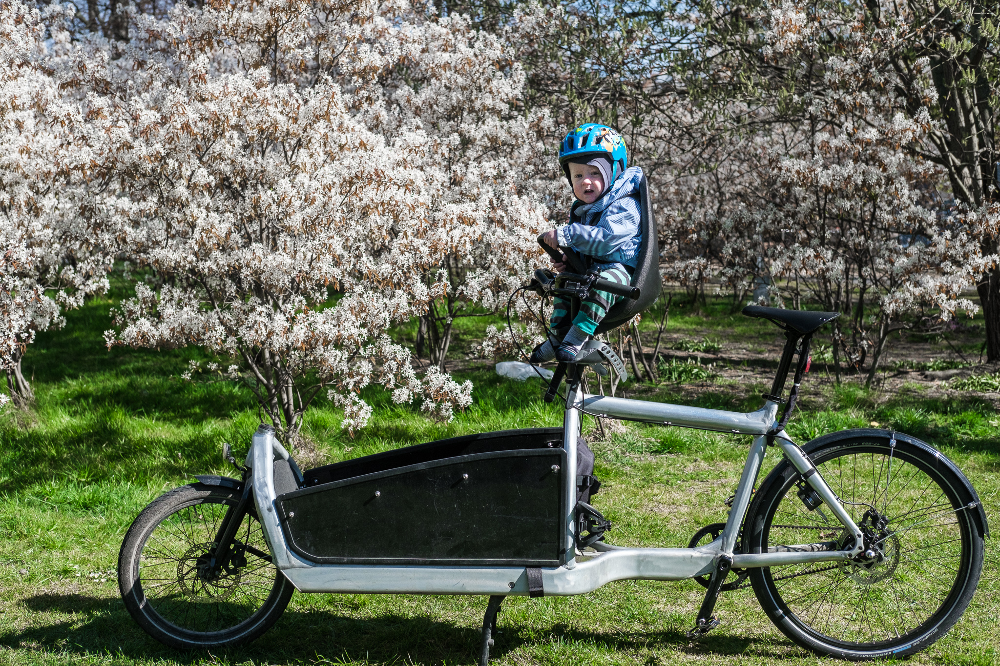
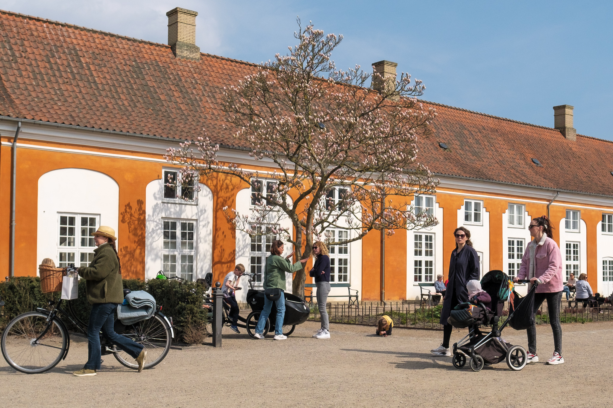
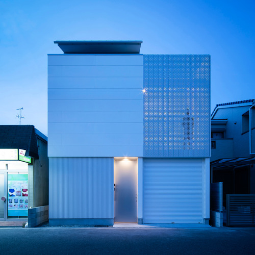

<main credit="" quote="">

Hi all,

My son had his first day back at daycare today (I’m writing this on Monday).

When he left, he wasn’t yet able to stand on his feet. He was just starting to say “hi” and wasn’t obsessively waving at things. He wasn’t yet one year. But now he’s (sort of) walking, getting incredibly creative with his toys, and as I tucked him in tonight, waved sleepily and bid me goodnight with a “Hi.”

Navigating the past weeks and months has been confusing as the coronavirus has made its way around the world and into our lives. At the end of January, I ordered some masks for the family just in case and at the time worried that they’d only get used the next time we had to paint something. This past week, my wife and I have been quietly obsessing over whether sending him back to daycare was the right call — knowing that the health outcomes of our decision wouldn’t reach us for days or weeks.

So much of the work of design is around navigating unknowns, which I’ve written about in the [past](https://divergeweekly.com/issue/2/) [few](https://divergeweekly.com/issue/3/) [posts](https://divergeweekly.com/issue/4/). We have tons of tools to make that navigation a bit less fraught, but ultimately our goal is to reduce the absolute surface area of the true unknowns and take our best guess at what we should cover it with. A small patch of true Unknown (I’m trying not to [invoke Rumsfeld](https://en.wikipedia.org/wiki/There_are_known_knowns) here, but you know what I mean) can bring the whole edifice down, but it’s less likely to.

In Copenhagen, the unknowns are being navigated in several ways. People are out. They’ve active and enjoying public space where they can find them. They’re keeping their distance. This photo perfectly captured the “vibe” of a weekend in Copenhagen: Small groups keeping their distance. Masks are still unusual: I wear mine in the market and it clearly surprised people. And the day cares are opening. I navigate these unknowns in a way that is informed by what I see in Asia, and what North America and Europe are only now coming to understand.

Looking at the [Danish government’s decision to open daycares](https://www.thelocal.dk/20200413/schools-and-day-care-centres-gear-up-for-staggered-and-restricted-reopening), I see a bit of this personalized navigation of the unknown. That surface area of True Unknowns has become a little bit smaller, and so perhaps something can be built on it. The government is setting a scope, and the schools are implementing it as best they can. We’ll know how it went in a few weeks. Certainly as a parent, the time afforded to work and be productive by state-supported child care is welcome. I probably had my most productive morning in the six weeks my son has been home during the work day, but I know that time is built on unknowns. It’s built on the labour of others taking a risk. It’s built on a Danish societal valuation of certain things over others. It’s built on a risk tolerance that is only possible with privilege.

So we’ll see over the next bit. I know many of you reading this are in Canada and the US, and things are [pretty scary](https://ourworldindata.org/grapher/total-cases-covid-19?stackMode=relative&time=2020-02-14..&country=DEU+ITA+DNK+CAN+USA). We’ll see whether what we built holds. In the end, design is in large part about making decisions based on what we’ve learned and committing them to form. It’s not faith, but it might be a particular kind of localized [interpolation](https://en.wikipedia.org/wiki/Interpolation) of what we’ve come to know (or believe) over the true unknowns that still exist within our scope of design. Of course, our methods of interpolation can skew that result [pretty wildly](https://matplotlib.org/1.5.3/examples/images_contours_and_fields/interpolation_methods.html).

We don’t always get a choice when to navigate an unknown, and we don’t always get a choice in the navigation either. But for now, this first day with our son back at daycare was scary for the unknown seeds it plants and outcomes that grow out of it. But then, positively influenced by his playmates and the incredible team of teachers at his school, perhaps we’re focusing on the wrong outcomes?

Thanks as always for reading this. I tried a bit of a different format this time (lighter content, more visual), and would love to hear what you think (you can just reply to this email directly).

As always, [please subscribe to and share Diverge Weekly](https://divergeweekly.com) if you haven’t and [send me a note](mailto:alb@andrewlb.com) if you have questions or feedback!

</main>

<voices who="Alix Gillet-Kirt" role="Associate Designer at UNHCR" image="img/ ">

Alix is an incredible designer and artist, originally from Champagne region of France and currently living and working in Copenhagen at the UN Refugee Agency (United Nations High Commissioner for Refugees) as a designer.

Apart from the work she does for the UN, she also does brilliant watercolour work of Copenhagen and beyond under the moniker l'atelier microscopique.

[L'atelier Microscopique](https://ateliermicro.bigcartel.com/)

</voices>

<twitter who="skamille">

[A friend just described a particular tech company as "a place with a lot of lead guitarists" and I'm still in awe of that analogy](https://twitter.com/skamille/status/1250213998836006912)

</twitter>

<region>

[[region | South Asia]]
|[Indians build their own lockdown barricades in the country's slums](https://widerimage.reuters.com/story/indians-build-their-own-lockdown-barricades-in-the-countrys-slums)
|A collection of incredible imagery and terrible anxiety from the slums of Mumbai.

[[region | Americas]]
|[American Jubilee](https://fellowtravelersblog.com/2020/04/20/american-jubilee/)
|A progressive foreign policy take on supporting the global south in a pandemic.

[[region | East Asia]]
|[Beijing’s Propaganda Is Finding Few Takers](https://foreignpolicy.com/2020/04/20/coronavirus-propaganda-china-developing-world/)
|The CCP is using the coronavirus as a mechanism to assert its own through various means, but this article argues that those efforts are failing. Personally, I'm watching China's efforts with interest.

[[region | MENA]]
|[Black Wave by Kim Ghattas review – insightful history of Middle Eastern conflict](https://www.theguardian.com/books/2020/jan/19/black-wave-saudi-arabia-iran-rivalry-that-unravelled-middle-east-kim-ghattas-review-middle-east)
|I'm about halfway through this really wonderful book narrating the history of the middle east's 1979 tumult through the lens of artists, poets, designers, journalists, and clerics living it.

[[region | Africa]]
|[Postcard from the future: I will lose myself in Marrakech](https://www.theguardian.com/travel/2020/apr/20/postcard-from-the-future-lose-myself-in-marrakech-morocco)
|I don't love the genre of travel writing for a lot of reasons (see: Cynthia Enloe). But this little note to Marrakech, a city I also absolutely love, resonated.

[[region | Europe]]
|[Rolling Back Some Coronavirus Lockdown Restrictions, Denmark Opens Salons and Barbershops. A Haircut Booking Site Crashed Due to Demand](https://time.com/5823615/denmark-haircuts-coronavirus-lockdown/)
|My wife did a wonderful job touching up my hair. I think I gave her quite a nice buzz cut. Everyone has a different tolerance for risk.

</region>

<image credit="Yoshiaki Y Architect" link="http://curiousarchitect.com/?p=2310">

</image>

<security credit="">

[Why China is Developing Military Vessels at the Center of its Coronavirus Outbreak](https://www.voanews.com/science-health/coronavirus-outbreak/why-china-developing-military-vessels-center-its-coronavirus)

Similar to the earlier Foreign Policy article on Beijing, this article shares some interesting context on Chinese investments in extending and maintaining power as the existing global system seizes and sputters under the weight of this pandemic.

"China is “taking advantage of the lull in activity” around the world by bolstering its military in nearby seas, said Jay Batongbacal, international maritime affairs professor at University of the Philippines."

Again, all of this should be watched with interest and potentially alarm.

</security>

<jobs>

[[jobad | Design Research in Tokyo]]
|[Design Researcher, IDEO Tokyo](https://www.ideo.com/jobs/design-research/tokyo/2018543/design-researcher)
|Located in Tokyo
|
|This looks like an awesome role for a Japanese/English bilingual design researcher. One of my big regrets from my time at IDEO was not making it out to the Tokyo studio, as it sounded like an absolute blast. Strongly recommend applying if you've Japanese language skills!

[[jobad | US CX ]]
|[Multiple CX Roles, USA](https://smeqa.usds.gov/info/cx-govwide/)
|Located in USA
|
|Through USDS, multiple agencies are hiring for Customer Experience/User Experience roles. Likely you'll need to be a US Citizen or otherwise eligible for a federal job, but this is an exciting victory for citizen's experience using government services at a time when it is desperately needed.

</jobs>

<sponsor image="https://www.knowsi.com/static/tier1.png">

## Knowsi

Knowsi manages consent for user research. Send and track participant consent with custom forms and GDPR-focused tools.

[Join Knowsi today for free!](https://knowsi.com)

</sponsor>

<image credit="Hanasaki House Yokohama, Kanagawa Prefecture – design by MoNo" link="https://www.e-architect.co.uk/japan/hanasaki-house">

</image>
