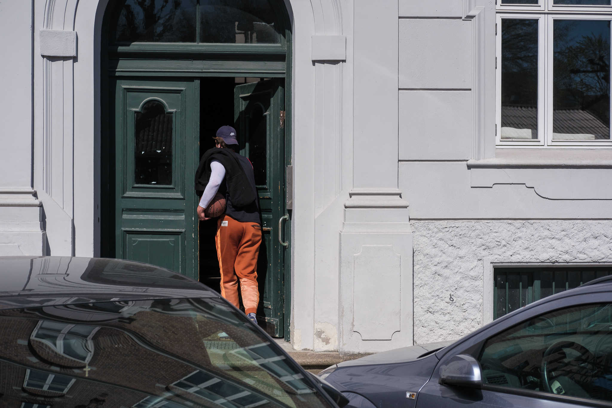
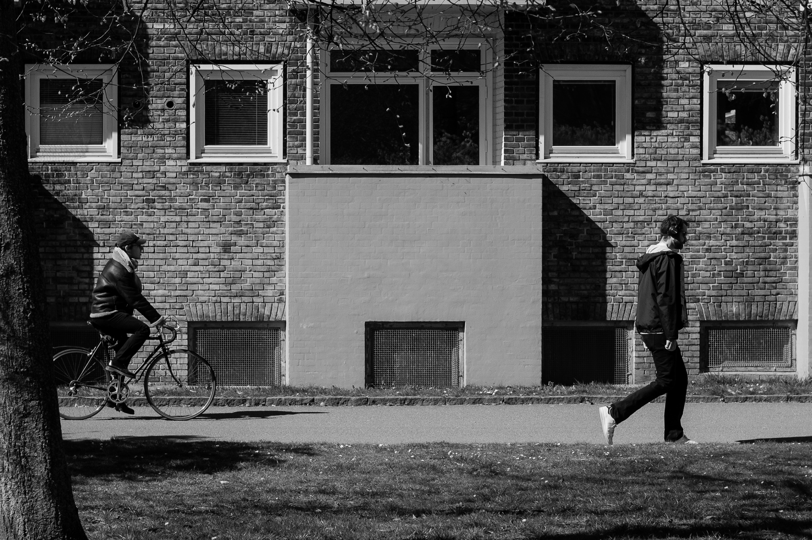
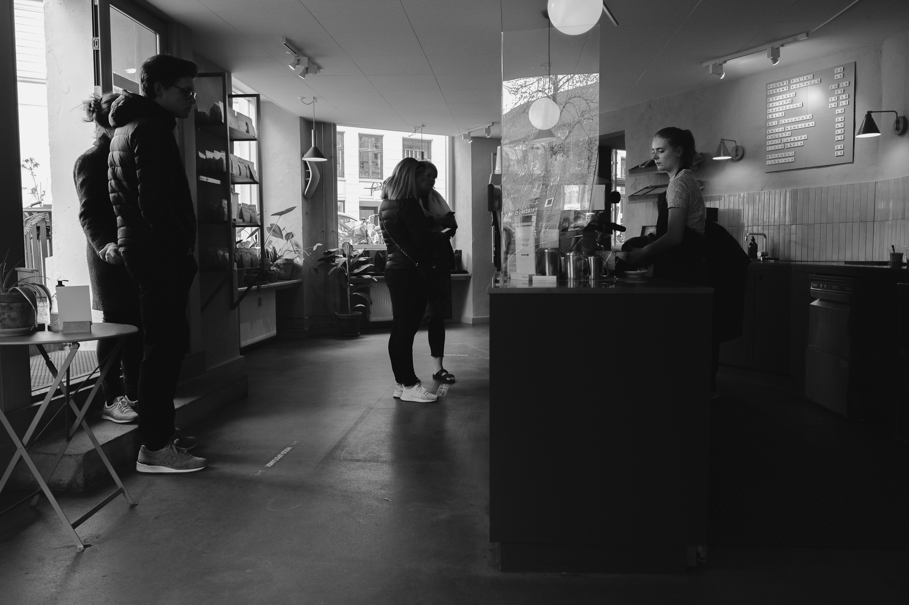
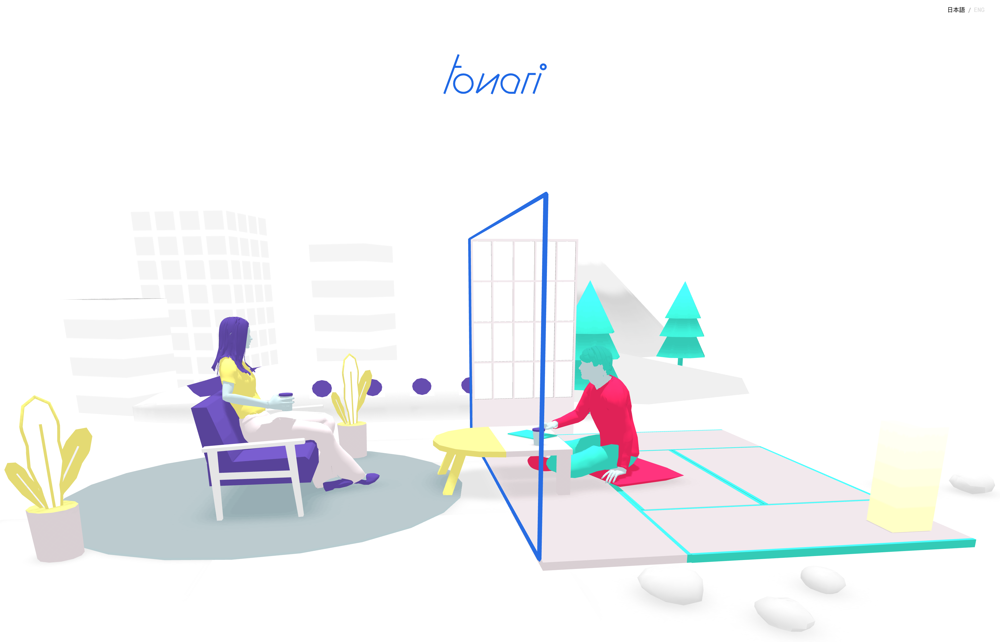

<main credit="" quote="">

Hi all,

Everyone I talk to lately is tired.

For those of us in countries with a nominal “flattened” curve, it feels like like we’ve climbed up
to a ledge to find a temporary respite, with the knowledge that we can’t stay here too long. Those
experiencing still uncontrolled outbreaks (the idea of control itself is dubious) only have the
belief that a ledge might be close by — without much thought for where one goes next. Either way, we
find ourselves stuck, unsure of how to get down safely or keep going forward. And this is an
experience that everyone is independently living.

The [impact of uncertainty on stress](https://www.theatlantic.com/health/archive/2015/03/
how-uncertainty-fuels-anxiety/388066/) is something that is often obvious and widely acknowledged,
but still insidious. We might dismiss a friend’s inquiry into our well being with a “Things are
good” or “I’m fine” not because we feel that way, but simply because it’s the ingrained default. The
construct of normalcy around us — whatever that normal might be — drives our behaviours until those
norms are no longer load bearing.

I think we’re hitting that point where the erosion of localized norms is beginning to undermine the
foundations they were built on. The Prussian military scholar Clausewitz (I’m a security studies
student, what do you expect?) has this idea of [Friction](http://www.strategybydesign.org/friction)
— the accumulation of little unknowns and events that undermine “the plan.” Clausewitz argues that a
path to victory in war is managing the relative friction between various combatants: reduce your own
friction and increase the enemies. The ubiquitous American MQ-9 Reaper drone is an example of
something that amplifies an enemy’s friction (“Where the hell is that buzzing coming from?”) and
reduces allies friction (“Eyes in the sky”). But we don’t have a Reaper drone for our current
situation.

Instead of other humans, we are engaged in a species-wide war of friction against a virus. Covid-19
is a particularly friction-producing bastard. Its slow incubation timed and high infection rate
allowed it to slip past our virological Maginot line, and emergency measures have been the result.
By staying home and keeping physically distant, we’re doing something to balance those scales: the
virus can’t spread what it can’t reach, and even if it does, it can’t spread far within an isolated
household. This creates friction for the virus and we’re starting to see the results — [Angela
Merkel’s explanation of the effect of friction on the virus’ spread](https://www.vox.com/2020/4/17/
21225916/coronavirus-in-germany-angela-merkel-lifting-lockdown) being perhaps the best framing of
the impact that we can have.

But still our norms are eroding. My wife, son, and I had a picnic in the park this weekend with some
friends. They sat two meters away and we commented on how weird it was. It was also an absolutely
incredible relief and utterly surreal at the same time.

There’s a New Yorker article that came out this week called [Abandoned](https://www.newyorker.com/
magazine/2020/04/27/americas-abandonment-of-syria). It explores the American abandonment of the
Syrian Democratic Forces — a mostly Kurdish force responsible for the defeat of ISIS in Syria and
long-time ally of the US. The entire thing is worth your time, but the section on the re-habitation
of Raqqa stood out for the dynamism with which people were trying to reclaim their lives. Wiring
electricity for light and television, planting a garden, cleaning the debris as best they can. In
shattered buildings, families are doing whatever they can do reclaim the shape of normal, but will
never see those previous lives.

The human impact of the Syrian civil war and our current battle with covid-19 can’t and shouldn’t be
compared, but it points to what happens when our foundations are torn from us: we establish new
ones. New norms come slowly and with pain, but they do come. Often, design (particularly interaction
design) looks at eliminating friction as completely as it can, but sometimes friction can beneficial
results. An example is the [IKEA effect](https://en.wikipedia.org/wiki/IKEA_effect), which shows
that people tend to over-value things they create — like building Ikea furniture.

The friends I met in the park had shared how they’d taught themselves to make bagels, how they were
looking after a sick friend from a distance, and how they’d rediscovered their playstation.
Anecdotally, everyone seems to be making sourdough — the shortage of dry yeast in grocery stories
spurring folk to discover that yeast that is constantly floating around us. In the book [Wild Ones](https://amzn.to/2Sgs8Rr), Jon Mooallem explores the idea of shifting baselines relative to
generational norm setting — what we understand as “normal” isn’t the normal for our children or
those geographically dispersed. But what we’re experiencing now is this shift at a much more
dramatic speed.

Writing this newsletter each week has — for me — been a bit like that act of making sourdough or
bagels in reaction to those shifting baselines. It’s a manifestation of my own labour and allows me
to meditate a bit on what each week or sequence of weeks feels like — from my own perch in
Copenhagen working as a product designer and manager, from the news and articles I read from around
the world, and from the people I talk to across timezones. We are all incrementally building new
norms — some of us under incredible stress and risk, others from a position of privilege. And
perhaps the confluence of those new norms — and the friction they create for the coronavirus’ spread
— will create a more resilient world on the other side.

As always, [please subscribe to and share Diverge Weekly](https://divergeweekly.com) if you haven’t and [send me a note](mailto:alb@andrewlb.com) if you have questions or feedback!

</main>

<voices who=" " role=" " image="img/ ">

fdsdfsdf

</voices>

<twitter who="johnysun">

[everyone in quarantine can have one (1) minute of focus per day, as a treat](https://twitter.com/jonnysun/status/1255271802219225090)

</twitter>

<region>

[[region | East Asia]]
|[Japan’s onsen provide virtual reality antidote to lockdown blues](https://www.scmp.com/week-asia/lifestyle-culture/article/3081484/coronavirus-japans-onsen-provide-virtual-reality)
|The ways that different cultures and communities simulate a lost experience is worth watching, because the simulation might become the experience itself before long.

[[region | South Asia]]
|[Inside the world's biggest lockdown](https://overcast.fm/+WEGkNqmuU)
|Today Explained is a fantastic podcast, and this episode explores some of the stories and systems behind India's lockdown. The migration trigger is worth noting

[[region | Americas]]
|
|

[[region | MENA]]
|[How Jordan is flattening its COVID-19 curve](https://www.aljazeera.com/news/2020/04/jordan-flattening-covid-19-curve-200422112212466.html)
|The bit at the end about the Stringency Index popped out as a fascinating point for design to inflect policy making and citizen uncertainty.

[[region | Africa]]
|
|

[[region | Europe]]
|
|

</region>

<security credit="">

sdfsdf

</security>

<jobs>

[[jobad | ]]
|
|Located in
|
|

[[jobad | ]]
|
|Located in
|
|

</jobs>

<sponsor image="https://www.knowsi.com/static/tier1.png">

## Knowsi

Knowsi manages consent for user research. Send and track participant consent with custom forms and GDPR-focused tools.

[Join Knowsi today for free!](https://knowsi.com)

</sponsor>

<image credit=" " link=" ">

[Tonari](https://tonari.no/) (Japanese for "beside" or "next to") is an exciting looking telepresence idea. Tons of groups have tried this kind of thing (Cisco, Oblong Industries, etc), but this one has a particularly human and these days, particularly appealing skin on it. Worth keeping an eye on!

</image>
