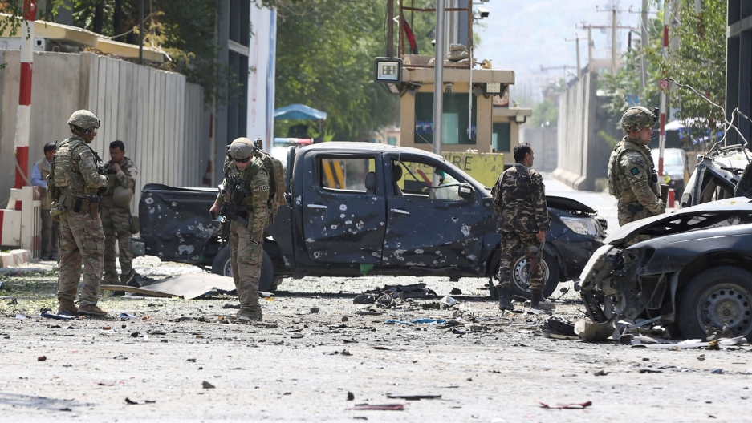
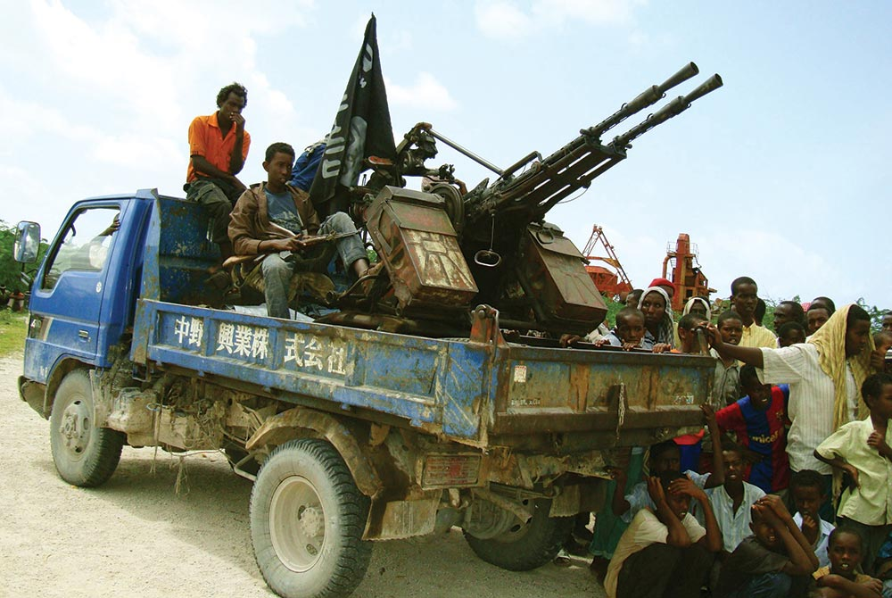

NATO forces investigating an VBIED. Credit: [Omar Sobhani/Reuters](https://www.pri.org/stories/2019-09-09/trump-abruptly-canceled-afghan-peace-deal-what-comes-next)

_This was my term paper for the first module in my Security Studies MA, written December 2019. Sharing here as a writing sample and because I enjoyed the process of writing it._

The relationship between terrorism and failing states has an intuitive ring to it. As then-US Senator and later Secretary of Defense Chuck Hagel argued in 2004, “Terrorism finds sanctuary in failed or failing states, in unresolved regional conflicts, and in the misery of endemic poverty and despair” (Hagel, 2004, p. 65). However, the true association is more suspect. The goal of this essay is to interrogate this relationship by deconstructing the value-driven language of terrorism and failing states, exploring the evidence that illuminates the complexity of the relationship, and considering what emerges from that complexity.

While exploring examples primarily from Afghanistan and Somalia, as well as broader reaching empirical work, I conclude that the rhetorical relationship between terrorism and failing states is one of convenient adjacencies, rather than one intrinsic to the nature of failing states that causes terrorism to emerge. To the contrary, while failing states can serve as bases of operations for terrorist organizations, they also present considerable operational complexity engaged out of necessity, not desirability. The convenient rhetorical framing of failing states as a source of terrorism falls short of acknowledging this, instead activating value-laden and state-centric language to construct a state-level response to what is usually a sub- or non-state threat. Ultimately, the association between terrorism and failing states has emerged as a point of operational circumstance for the terrorists and a point of rhetorical convenience for their opponents, resulting in the failing state label exacerbating the existing dimensions of state failure. Finally, we will consider the opportunity cost in lives and capital by which this convenience is purchased, and how it might be spent differently or not at all.

## Defining Terrorism

In order to consider its relationship to failing states, terrorism must be deconstructed through the actions it engages in and upon what scope it operates. Terrorism is difficult to define, but is overwhelming framed by its application of violence to political ends (Duyvesteyn, 2004, p. 440) and often against civilian targets (Burke, 2008, p. 39). However, as Shanahan points out in his exploration of the definition of terrorism by states and academic sources, “no two are identical, and there are significant differences among them” (Shanahan, 2010, p. 176). By focusing too deeply on isolating a definition of terrorism as a generalized act, the term itself loses its value as an analytical unit rooted in the political context of its execution (Dexter, 2012, p. 124). In order to ground an analysis of the relationship between terrorism and failing states, then terrorism must be situated in a space, a time, and an actor-based context to hold relevance. Using this lens, the primary unit of comparative analysis I focus on is actors and organizations who conduct terrorist activities, instead of the abstract idea of terrorism itself.

Situating terrorism enables an exploration of the organizations and individuals responsible for terrorism within the context of failing states. Terrorist organizations engage in terrorist acts; they are organizations of individuals who conduct politically motivated violence often against civilian targets. Terrorist organizations are often “small organizations operating somewhat secretly without the power to take and hold territory” (Shapiro, 2013, p. 2), situating the definition in the covert and the asymmetric with regards to power. While there are many different types of terrorism (Jackson, 2011, p. 152), this framing permits a focus on international and domestic terrorism conducted by non-state and sub-state actors. Specifically, state terrorism is omitted in this consideration as outside of the scope of this analysis, although it does not to diminish the role that state terrorism holds in any broad definitional discussion on terrorism and its human impact (Jackson, 2011, pp. 183–195). In considering the connection between terrorism and failing states, state terrorism demonstrates how state-level actors wield the instruments of the state against its citizens and enemies domestically and internationally (Jackson, 2011, pp. 183–187). Observing a failing state engaging in state terrorism would present a different focus of analysis: that of state terrorism contributing or resulting from state failure versus separate coinciding phenomena executed by some entity other than the state or political elite.

In other words, the definition of terrorism in this analysis is necessarily one which is situated in time and space through its organizational structure, observable in that they have engaged in the act of terrorism and can be considered in historical and regional context, and distinct from the state and its institutions. One can contrast two maligned organization to exemplify the definition: before the US invasion, al-Qa’ida was considered a sub-state terrorist organization as it engaged in international terrorism and existed as separate but supported by the Taliban-controlled state of Afghanistan (National Commission on Terrorist Attacks upon the United States, 2004, pp. 50–52). Despite being a bureaucracy situated in Afghanistan (Byman, 2019, p. 68), al-Qa’ida remained organizationally distinct and often ideologically opposed to the Taliban (Byman, 2019, pp. 60–61). The Taliban is a state level actor that — while arguably engaging in state terrorism against its own population under its construction of Shari’a law (Hehir, 2007, p. 319) — held territory and otherwise wielded the apparats of state (National Commission on Terrorist Attacks upon the United States, 2004, pp. 63–67). The Taliban even engaged in (unhelpful) dialogue with the United States as a state-based power (National Commission on Terrorist Attacks upon the United States, 2004, pp. 110–111). By focusing on terrorism as situated in organizations and thereby an observable phenomenon, it becomes possible to explore how two separated concepts — terrorism as an observable phenomenon and failing states as a label to their cultural and political context — can co-construct a threat narrative to a given state’s national security interest so great as to justifying costly intervention (Hehir, 2007, pp. 310–311) and state reconstruction (Krasner and Pascual, 2005, pp. 153, 163). But having defined terrorism in these terms, what is this label of the failing state?

## Defining Failing States

Forces patrolling in a poppy field. Credit: [Kaily Brown/U.S. Army](https://www.stripes.com/news/un-report-afghan-opium-survey-reports-record-high-growth-in-2013-1.252436)

In a Washington Post op-ed, then US Secretary of State Condoleezza Rice wrote “The greatest threats to our security are defined more by the dynamics within weak and failing states than by the borders between strong and aggressive ones” (Rice, 2005). This statement reflected a feeling that was prevalent in the United States and its allies following the attacks of 2001 and had been percolating since the collapse of the Soviet Union: that while western liberal democracy was seen as ascendant, threats existed to the liberal democratic order that were best solved by the promotion of democracy abroad (Hehir, 2007, pp. 321–332; Verhoeven, 2009, pp. 407–408). Only a few months earlier, Secretary Rice’s teams proposed a new agency to engage in country reconstruction stating that “elements of state weakness constitute structural threats akin to dead leaves that accumulate in a forest. No one knows what spark will ignite them, or when. Over the long run, the only real way to create lasting peace is to promote better governance” (Krasner and Pascual, 2005, p. 155). In this view, failing states manifest insecurity through the complexity of potential emanating threats — refugees, drugs, disease, and most importantly in this discussion, terrorism­ — within their borders (Simons and Tucker, 2007, p. 387). By way of example, in the mid 2000s, over a decade of domestic conflict within Somalia had seen the rise of a burgeoning and popular Islamic governing coalition: the Council of Islamic Courts (CIC) (Menkhaus, 2007, pp. 364–365). In this case, certain members of that coalition – specifically al-Shebaab – were understood to be aligned with al-Qa’ida, but little evidence seemed to exist that they were a new franchisee of al-Qa’ida (Byman, 2019, pp. 159–160). Despite this, the association was leveraged to construct a now-familiar narrative that failing states breed terrorism: a frame that the Ethiopian military used to generate a rationale for intervention and recruit American support. The threat of terrorism to Ethiopia and America, and therefore the imperative to intervene in Somalia, were grounded in the probability ­— and not the certitude — of a threat (Verhoeven, 2009, pp. 416–417). This example suggests that failing states do not pose a deterministic threat (as a hostile nation with a standing army might), but rather represent a source of emergent and unpredictable insecurity.

However, any of these aforementioned threats can emerge from within otherwise economically stable, western nations. One need only consider the Irish Republican Army and its offshoots in the United Kingdom (Jackson, 2011, pp. 33, 131) as an obvious example. So if the security outcomes of failing states can manifest in non-failing states, what exactly is a failed, failing, fragile, or weak state in the first place? The Canadian International Development Agency (CIDA) has a helpful definition:

“Though no universal definition of ‘fragile state’ exists, states are perceived as fragile when the government does not demonstrate the will and/or capacity to deliver on core state functions such as the enforcement of legitimate security and authority, the protection, promotion and implementation of human rights and gender equality, the rule of law, and even the most basic provision of services (e.g., in health and education, in enabling the private sector, and in environmental protection). When these core state functions are unreliable or inaccessible, the legitimacy of the state erodes and is likely to result in a breakdown in the social ‘pact’ of trust and cooperation within civil society and between civil society and the state.”(Keating, 2016, p. 12)

This definition presents two helpful insights. First, it hints at the idea of failed, failing, fragile, and weak states existing along a continuum: that perhaps rule of law might function, but gender equality might not. As Simons and Tucker point out, “entire regions don’t collapse; entire states never fail. Not everything falls apart, even when there is no government control” (Simons and Tucker, 2007, p. 391). With this in mind, I primarily frame state failure as situated upon a multidimensional continuum within the context of a given “failing” state relative to a western liberal ideal (Bøås and Jennings, 2005, p. 387).

The second insight within the CIDA definition is that the “human security” paradigm undergirds this framing of failing states. Human security proposes a shift away from the state as the operational unit of analysis, instead focusing on the individual as the referent object in considering issues of development and security, as well as a more multidimensional framing of what constitutes a threat to the security and dignity of the individual (Bøås and Jennings, 2005, p. 389; McCormack, 2011, pp. 238–239). In the CIDA framing of fragile states, the legitimacy and stability of a state seems to break down as its capacity to engage in the economic, legal, and physical security of the individual degrades. But as McCormack points out, this breakdown of individual rights provides a path via the language of human security to frame failing states as threats to powerful states (McCormack, 2011, p. 244), thereby situating these weaker states as a risk in the national security discourse of relatively more powerful and nominally stable state actors.

If failing states are measured along a continuum of adherence to the economic and physical security of the individual which itself is a measure of adherence to values espoused by a frame constructed by the institutions of a western liberal order (McCormack, 2011, pp. 243–244), then ultimately, the label of failing states is a normative construct describing state-based relationships and policy along the sliding scale of a western liberal value structure.

## Terrorism and Failing States

Al Shabaab Technical. Credit: [Reuters/Omar Faruk](https://www.accord.org.za/conflict-trends/disengaging-from-violent-extremism/)

Having established that terrorism exists in the context of sub- or non-state organizations that engage in terrorist activity and that failing states are constructed in relation to international power dynamics, what are we to do with the assertion that failing states are emergent sources of terrorism (Piazza, 2006, p. 159; Newman, 2007, p. 463; Simons and Tucker, 2007, p. 387)? In the empirical discourse exploring this relationship, there seems to be only a loose association between failing states and terrorism (Piazza, 2006, pp. 172–174; Newman, 2007, pp. 483–484).

Significant amongst the conclusions is that while terrorist organizations and action can occur within the context of failing states, they can also — and in fact are more likely to — manifest in stable ones (Newman, 2007, p. 483). This observation supports the threat construction drive behind the application of failing state labels to a given national context, and serves to structure a potential counter-narrative to the emergence of terrorism in failing states: one that suggests that the risk and complexity presented by failing states can be as likely to undermine terrorist organizations as they are to support their endeavours which often rely upon access to infrastructure, communication, and resources (Hehir, 2007, p. 321). In contrast, state institutions in stable and/or democratic states may serve to benefit more clandestine or nascent terrorist organizations through access to welfare systems and the freedom to operate and recruit through the protection of free speech (Hehir, 2007, p. 320). In other words, failing states fail terrorists too.

If terrorist organizations are as likely to emerge in more stable and wealthier nations, then why the connection between failing states and terrorism? Newman observes that while the actual level of terrorist activity is relatively low, the most destructive terrorist groups are located in failing states (Newman, 2007, p. 475,483). Al-Qa’ida has existed for decades as a terrorist organization in opposition to the Russians before it committed the most lethal terrorist attack the world has seen since the 1960s (Jackson, 2011, p. 135), but it was this singular and horrifying attack that transformed routine counter-terrorist activities (National Commission on Terrorist Attacks upon the United States, 2004, p. 115) into a global War on Terror (Jackson, 2011, p. 250). If acts of terror serve as a perverse form of political communication by terrorist organizations (Jackson, 2011, p. 116), states are also able to leverage their institutional and rhetorical powers to offset and combat this violent communication, such as by framing the fight against al-Qa’ida as part of a broader War on Terror (Jackson, 2011, pp. 62–63) or by labeling their supporters as failing states (Simons and Tucker, 2007, pp. 388–389). This not only serves to mobilize resources on the local level, but also to recruit other state and institutional actors to its on security needs (Buzan, 2006, pp. 1103–1104). The effect of this approach is tragically exemplified in the American failure to acknowledge the Somali Council of Islamic Courts as a legitimate state actor, and instead — as they had with the Taliban — situated them as first-and-foremost al-Qa’ida supporters (Menkhaus, 2007, pp. 377–378). This framing served as justification for an escalation and eventual invasion of Somalia by Ethiopian forces, a decision that threw a failing state rebuilding itself from within back into chaos (Verhoeven, 2009, pp. 416–417). So while Somalia is functionally the working model of the failing state (Verhoeven, 2009, p. 406), in this instance the label becomes self-fulfilling in the eyes of more powerful state actors and undermined the efforts of an otherwise potentially legitimate and effective local governing coalition.

In the case of Afghanistan, it appear as though the label of failing state was constructed not by its consideration relative to human security factors — though it certainly existed along that continuum (Hehir, 2007, pp. 318–319) — but by the terrorism of al-Qa’ida and the threat narrative constructed as a consequence of the 9/11 attacks. As Shapiro points out:

“What made Afghanistan so useful to al-Qa’ida from 1995 onward was not an absence of state institutions; it was that al-Qa’ida could operate under the protection of a sovereign state, relying on that state’s sovereignty to shield its infrastructure from potential attack by Western forces.” (Shapiro, 2013, p. 268)

When that sovereignty was undermined through the labeling of Afghanistan as a failing state — an action catalyzed by al-Qa’ida’s actions — the previous security and support that al-Qa’ida enjoyed (Hehir, 2007, pp. 318–319) was rapidly stripped away, and the organization was forced to adapt. Terrorist organizations are constantly managing their capacity to remain covert while still retaining a level of command-and-control over their operations, their ideology, and their resources (Shapiro, 2013, p. 8). Shapiro makes the argument that dramatic reductions in centralized control towards the more informal networked structure that has become a defining trait of al-Qa’ida is a response to an increasingly desperate security situation for the organization (Shapiro, 2013, p. 270). This suggests quite the opposite hypothesis to the dominant narrative about failing states and terrorism: that failing states present similarly complex operational or even existential challenges to terrorist organizations as they do to state actors. As Simons and Tucker point out, “terrorists also need a modicum of stability, they wouldn’t set themselves up in a collapsed state where they potentially become a bargaining chip between local factions” (Simons and Tucker, 2007, p. 398).

## If Not From Failing States

If terrorist organizations are not a phenomenon emerging from failing states, then they must come from somewhere. World leaders can be said to acknowledge that the threat of terrorism is not bound to the traditional statist lens, as then-Secretary of Defense Rumsfeld did when he said “There may not be as many beachheads stormed as opportunities denied. Forget about ‘exit strategies’; we’re looking at a sustained engagement that carries no deadlines” (Rumsfeld, 2001). In this view, conflicts with terrorist organizations are multidimensional and complex: lacking a single situated location but rather lurking behind the “bankers’ pinstripes”, the “programmers’ grunge”, and certainly “desert camouflage” (Rumsfeld, 2001). Unfortunately, this statement may have proven prescient. The 9/11 hijackers came from diverse, generally privileged, and educated backgrounds across the Arab world (Friedman, 2017), empowering them to engage in a complex and covert terrorist act at an international scale. While stochastic events like the major international attacks of 9/11 belie reasonable prediction, the next big terrorist organization is likely to emerge from complexity: where population, diversity, and stressing factors like state repression converge (Piazza, 2006, p. 170).

Ultimately, the conclusion I draw is that the terrorism of situated terrorist organizations can emerge anywhere, and that failing states are not significantly more likely to give rise to these groups and actions than stable states (Newman, 2007, pp. 483–484). Instead, if we acknowledge that failing states exist along a continuum of failing, then a potential way forward is to explore how specific populations at risk of radicalization might be failed by the state and its institutions, as “all states consistently fail some portions of their population” (Simons and Tucker, 2007, p. 400). This framing allows us to shift the language of failing states away from the unit of the state and its potential as a threat, and onto the specifics of how, where, and by what degree the state is failing the individual.

This shift away from the state-level of analysis points to effective ways in which the emergence of terrorist organizations can be stymied at the local level (Simons and Tucker, 2007, pp. 394–400). As Shapiro observes, terrorist organizations face a dilemma in which control and efficiency are in tension with security and covertness (Shapiro, 2013, p. 56). While the failure of state institutions can serve to shift their focus towards security as with al-Qa’ida after the retreat of the Taliban from state power, we should consider how else to put maximum pressure on terrorist organizations in order to undermine their ability to execute in a coherent and centralized fashion (Shapiro, 2013, p. 270). Simons and Tucker’s suggestion that engagement with local forms of governance and alliance outside of the norms articulated in the failing-versus-stable-state narrative (as constructed by the principles of human security) might be one path towards putting that pressure on terrorist organizations (Simons and Tucker, 2007, pp. 397–398). In the case of Afghanistan, they point out that: “Westerners seldom look at the world the way non-Western locals do, and thus seldom know where or how to look for what terrorists might be up to.” (Simons and Tucker, 2007, p. 396) By engaging critically with the dimensions through which a state (either ones own or another’s) fails some group or individual, then perhaps the voids and vacuums in which a terrorist threat might take root can be ferreted out.

## Conclusion

The Bundy Ranch standoff and the question of domestic terrorism? Credit: Unknown.

Terrorism does not emerge from failing states any more than it emerges from stable ones (Newman, 2007). Rather, terrorism emerges from terrorist organizations, which in turn emerge and are situated where diverse populations come into conflict (Piazza, 2006, p. 170). Similarly, failing states do not emerge from terrorism, though as we have seen in the case of Somalia (Menkhaus, 2007; Verhoeven, 2009) and Afghanistan (Hehir, 2007; Simons and Tucker, 2007; Shapiro, 2013), situated terrorism can serve to rationalize the failing state label when applied by powerful state and institutional actors like the United States (Bøås and Jennings, 2005, p. 387).

In this analysis, it can be concluded that terrorism and failing states do not have a causal relationship, but rather a relativistic normative relationship can be constructed by elite, state, and institutional actors in order to functionally engage with the terrorist organization, the so-called failing state, or both (Hehir, 2007, p. 328). But if the label of failing state is one that can be constructed, then it can be dismantled as well. The label of failing states should not be a sentence carried by an entire state, but rather its constituent dimensions — with the many ways in which a state is failing or succeeding — should be considered in turn (Simons and Tucker, 2007, p. 400). When an understanding of terrorism is situated and performed by an organization forced to operate in the liminal spaces of state failure (Shapiro, 2013, pp. 265–269), the path to effectively combatting terrorist organizations lies not in constructing sweeping relationships between terrorism and failing states, but in forming relationships with local inhabitants to co-create stability and security.

## Bibliography

Bøås, M. and Jennings, K. M. (2005) ‘Insecurity and Development: The Rhetoric of the “Failed State”’, _The European Journal of Development Research_, 17(3), pp. 385–395. doi: 10.1080/09578810500209148.

Burke, A. (2008) ‘The end of terrorism studies’, _Critical Studies on Terrorism_, 1(1), pp. 37–49. doi: 10.1080/17539150701848241.

Buzan, B. (2006) ‘Will the “global war on terrorism” be the new Cold War?’, _International Affairs_, 82(6), pp. 1101–1118. doi: 10.1111/j.1468-2346.2006.00590.x.

Byman, D. (2019) _Road warriors: foreign fighters in the armies of Jihad_. New York, NY, United States of America: Oxford University Press.

Dexter, H. (2012) ‘Terrorism and violence: another violence is possible?’, _Critical Studies on Terrorism_, 5(1), pp. 121–137. doi: 10.1080/17539153.2012.659920.

Duyvesteyn, I. (2004) ‘How New Is the New Terrorism?’, _Studies in Conflict & Terrorism_, 27(5), pp. 439–454. doi: 10.1080/10576100490483750.

Friedman, U. (2017) ‘Where America’s Terrorists Actually Come From’, _The Atlantic_, 30 January. Available at: https://www.theatlantic.com/international/archive/2017/01/trump-immigration-ban-terrorism/514361/.

Hagel, C. (2004) ‘A Republican Foreign Policy’, _Foreign Affairs_, 83(4), pp. 64–76. doi: 10.2307/20034047.

Hehir, A. (2007) ‘The Myth of the Failed State and the War on Terror: A Challenge to the Conventional Wisdom’, _Journal of Intervention and Statebuilding_, 1(3), pp. 307–332. doi: 10.1080/17502970701592256.

Jackson, R. (ed.) (2011) _Terrorism: a critical introduction_. Houndmills, Basingstoke, Hampshire ; New York: Palgrave Macmillan.

Keating, T. (2016) ‘Responding to Failed and Fragile States: The Evolution of Canadian Policy’, in Carroll, M. K. (ed.) _From Kinshasa to Kandahar: Canada and fragile states in historical perspective_. Calgary, Alberta, Canada: University of Calgary Press (Beyond boundaries : Canadian defence and strategic studies series, no. 6), pp. 9–31.

Krasner, S. D. and Pascual, C. (2005) ‘Addressing State Failure’, _Foreign Affairs_, 84(4), p. 153. doi: 10.2307/20034427.

Krueger, A. (2007) ‘What makes a terrorist: Economics and the roots of terrorism (New Edition)’.

McCormack, T. (2011) ‘Human security and the separation of security and development’, _Conflict, Security & Development_, 11(02), pp. 235–260. doi: 10.1080/14678802.2011.572461.

Menkhaus, K. (2007) ‘The crisis in Somalia: Tragedy in five acts’, _African Affairs_, 106(424), pp. 357–390. doi: 10.1093/afraf/adm040.

National Commission on Terrorist Attacks upon the United States (ed.) (2004) _The 9/11 Commission report: final report of the National Commission on Terrorist Attacks upon the United States_. 1st ed. New York: Norton.

Newman, E. (2007) ‘Weak States, State Failure, and Terrorism’, _Terrorism and Political Violence_, 19(4), pp. 463–488. doi: 10.1080/09546550701590636.

Piazza, J. (2006) ‘Rooted in Poverty?: Terrorism, Poor Economic Development, and Social Cleavages 1’, _Terrorism and Political Violence_, 18, pp. 159–177. doi: 10.1080/095465590944578.

Rice, C. (2005) ‘The Promise of Democratic Peace’, _Washington Post_, 11 December. Available at: https://2001-2009.state.gov/secretary/rm/2005/57888.htm (Accessed: 8 December 2019).

Rumsfeld, D. H. (2001) ‘A New Kind of War’, _The New York Times_, 27 September, p. 21.

Shanahan, T. (2010) ‘Betraying a certain corruption of mind: how (and how not) to define “terrorism”’, _Critical Studies on Terrorism_, 3(2), pp. 173–190. doi: 10.1080/17539150903306139.

Shapiro, J. N. (2013) _The terrorist’s dilemma: managing violent covert organizations_. Princeton ; Oxford: Princeton University Press.

Simons, A. and Tucker, D. (2007) ‘The misleading problem of failed states: a “socio-geography” of terrorism in the post-9/11 era’, _Third World Quarterly_, 28(2), pp. 387–401. doi: 10.1080/01436590601153887.

Verhoeven, H. (2009) ‘The self-fulfilling prophecy of failed states: Somalia, state collapse and the Global War on Terror’, _Journal of Eastern African Studies_, 3(3), pp. 405–425. doi: 10.1080/17531050903273719.
