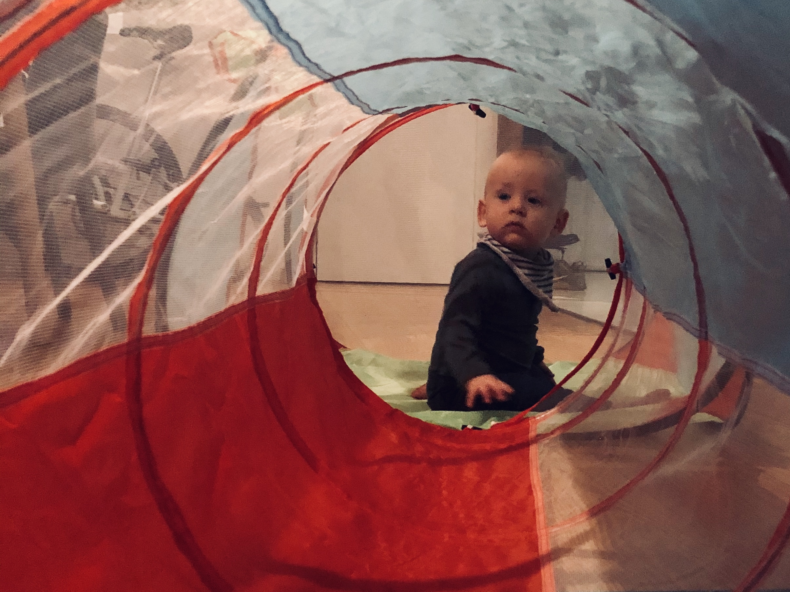
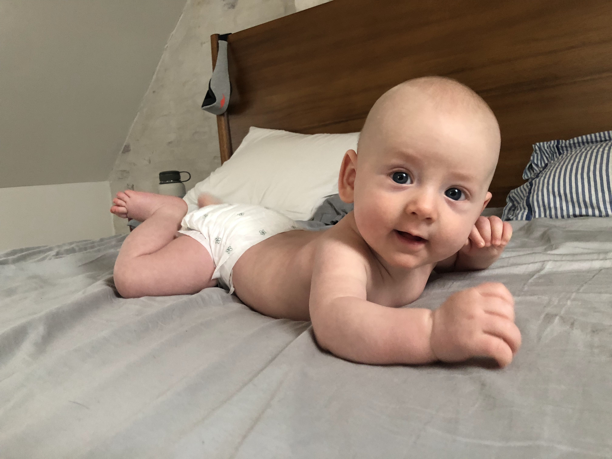
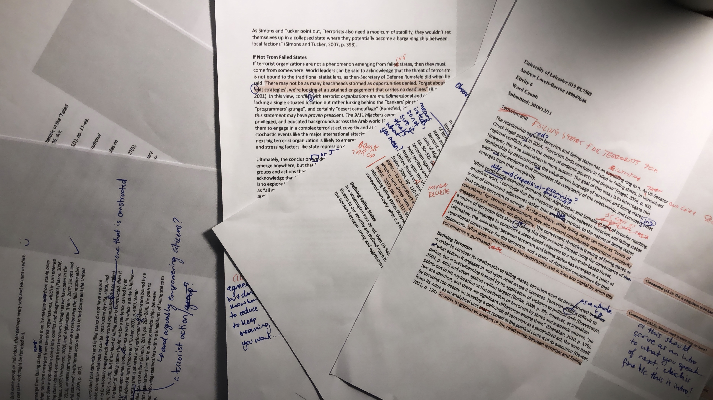
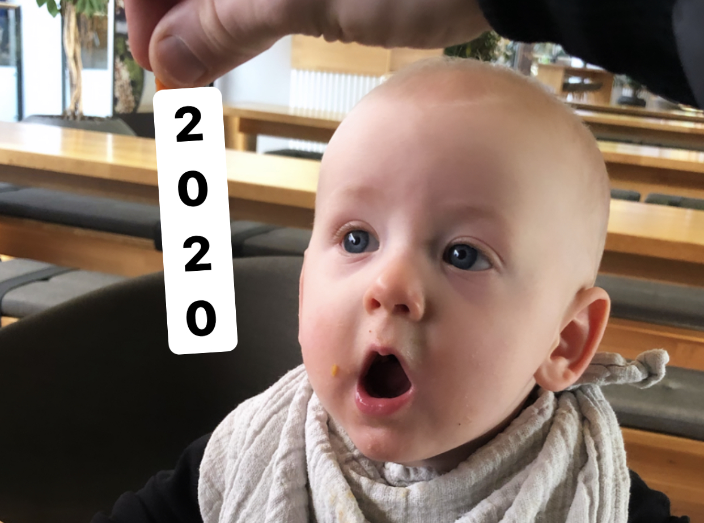

2019 has been a weird combination of my most exhausting, fulfilling, chaotic, and structured year to date. Midway through 2018, I decided that I wouldn’t share anything until it was “done”, or at least passed a significant milestone. So while I usually don't write posts like this, this year felt worth the reflection.

## Four Changes

Four big life changes happened this year, mostly set up in 2018.

First, and most importantly, my son Emil joined us. Writing this, he’s eight months and two weeks old. He's trying to figure out how to stand, can put himself to sleep, and the teeth are attempting to come through.

Second, I created [Knowsi](https://knowsi.com), a small SaaS business to manage informed consent in research. You can sign up for a free account if you use consent forms in your work.

Third, I started a (part-time) graduate program in International Security Studies at the University of Leicester. This is mostly inspired by my experience at the New America fellowship and at the Pentagon.

Fourth, I survived the fall, where all three of these came together with my consulting practice. Initially that survival was mostly a function of an unequal workload between myself and my wife, so not exactly sustainable or fair.

## The Baby – Emil

In the summer of 2018, I was back in the US for a few weeks and had just walked out of my NREMT exam when I called Ayla to tell her I'd passed. On the topic of positive test results, she shared that she was pregnant and everything started to shift. The remainder of that year became one of preparing for something neither of us really understood: in our bodies; our identities; our relationship to work, to the world, to each other, and to the son we hadn’t yet met.

Emil showed up on April 10th, 2019 at our home in Frederiksberg. For all the classes and reading and discussions of the previous months, I wasn’t even close to prepared. Since he’s arrived, every week has been different and every week forces something new learned.

With some planning and savings, I was able to take three plus months of paternity leave. In this whirlwind of diapers and family visits, I learned a bit about how caring for Emil manifested as action: changing a diaper, giving him a bath, checking if he’s warm enough, making sure he’s fed (the first few times the confused look he gave me was incredible), rewatching the baby heimlich on YouTube for the 12th time. Cumulatively these little acts have started to paint a picture of fatherhood for me that I want to build upon — parenthood as a craft. Any craft requires practice and introspection and that’s been (more than anything else) the past eight and a half months.

Ultimately, I think this means taking the quotidian parts of parenthood incredibly seriously. Little actions done frequently build up over time, and so those little actions will contribute to who he becomes. But as important are the intuitions acquired after doing something many, many times, and using those intuitions to deal with the unknown and the unpredictable. We'll see how this theory of parenthood changes, but at least for now this is the model I'm working with.

## The Product – Knowsi

[Knowsi](https://knowsi.com) emerged from a conviction that consulting as I had been doing likely wasn't the right path forward. Coming off of an extended consulting project that had seen me back-and-forth from the UK and fairly burnt out, I had been collecting and exploring different ideas (and savings) for a small, bootstrappable Software-as-a-Service business. My theory: knowing that Emil was on his way, I wanted to have something that could bring in income and support a working lifestyle that would let me be present.

I settled on Knowsi from a host of other ideas while flying into Paris for New Years 2019. Consent management had always been a challenge in user research, with lost forms and disempowered participants. As a user researcher myself, I knew the problem well and had seen when it goes wrong. It was a discrete need, something that I was solving for myself, and was feasible with my skillset as an indie developer and designer.

I spent the next few months getting it off the ground, piloting it with the the Copenhagen Institute of Interaction Design, and rapidly turning it into something that worked, could be used, etc. When Emil was born, I took a few months off, and my diaper changing speed improved considerably . Unfortunately, Knowsi didn’t progress much in that time, but I got my first customer and it was a huge boost in morale. In the fall, Ayla and I did a complete redesign of the site and relaunched it, and from there have figured out a good pattern of collecting feedback (and responding quickly to bugs), setting priorities, and aggressively pushing on particular features through time-bound sprints.

More than anything else though, I found that working on a business (vs a product) solo is maybe more trouble than its worth. While I can do most of the product work and some of the business, the constant focus switching is to to the detriment of the actual work. Also my marketing skills are useless. So in the new year, I intend to re-focus on Knowsi and seek collaboration and help from friends, colleagues, or people who share a similar excitement for qualitative research and privacy.

Finally, I also just launched free subscription tier to support students and solo researchers in gathering and maintaining consent with their research participants. So if you've been curious about what I've been working on but didn't want to put in a credit card, [now you can use Knowsi for free](https://knowsi.com/join).

## The Degree – Starting a Masters

This has been a long time coming. I've flirted with graduate school for years. In 2012, I'd been accepted to NYU’s ITP program and almost moved to New York. However, after months of soul searching, I ended up saying no because didn’t want to be in that kind of debt.

Since then, I’ve had a lot of fun: starting two businesses, working at IDEO, at the Pentagon, being a think tank fellow, and currently living a slightly charmed independent consulting/product person’s life in Denmark. But every single year I start musing about returning to school, though that idea of what I would return FOR has shifted over time.

Coming out of my Public Interest Tech fellowship with New America last year, I had started to explore working more deeply in issues surrounding the refugee crisis, climate change, and a more systemic view of security. Technology skills are great and useful, but I believe that to really be effective (and not harmful), I needed to shore up my knowledge of the issues and the critical discourse. So after many conversations, explorations, and books read, I landed on Security Studies as a field.

Despite my career in code and design, my academic roots are in political science, so I had (rusty) familiarity with the topic. I ended up reaching out to my former professor, Renan Levine. I actually hadn't had particularly good grades in Professor Levine’s classes, but I reached out to him because he had a massive impact on my transition into design. Specifically, he taught me how to visualize my thinking, how to approach it systematically, and how to use externalized ideation as a lever for creativity. Weirdly, I believe what I learned in his research, policy, and statistics classes became my entryway into interaction design and entrepreneurship. And despite nearly a decade between his classes and my application, he wrote my recommendation letters that helped me get into a security studies MA in the UK. (So thank you Renan and Matt Cutts for the letters of recommendation!)

Anyway, I've just wrapped up the first term and starting to think about my dissertation. I have difficulty expressing how excited I am for the whole enterprise. Life would be a lot easier without this as I have to be incredibly structured in my time: I’m often up till two or three in the morning, and it has meant getting creative with the day-to-day of the household (which I’ll talk about next). But even a few months in I feel like what I'm learning is surfacing new areas to explore and a new way for me to understand the issues that I care about, but have struggled to act on.

## The Problems — Survival

Finally, survival. This year has had a lot to do with privilege. My wife and I have benefited from the Danish child care policies. I had access to personal capital, skills, and time to start a small business. I had a network and the time to apply for a university. I had the network and skills to be selective in what I do work.

Despite this, the past year has been the busiest in my life. Keeping up with friends and social engagements has been a struggle. Beyond even the normal limits to sleep that new parents face, to get everything done I’ve had an unhealthy number of nights with just four to six hours of sleep.

Dealing with multiple responsibilities: Emil, working with Knowsi customers, consulting as a product manager with IKEA, leading design mentorship with the Innofounder accelerator program, and finally, acclimating to my grad program. When all of those came together in September, I managed to burn out in a few weeks and things weren’t working. I didn't see failure as an option though, and I was able to figure out some new techniques for time management and tracking everything. It involved late nights, but nothing really slipped — or at least that’s what I initially thought.

In this initial “balance”, I unfairly relied on my wife to pick up slack that I wasn't seeing or was dramatically de-prioritizing. [A weakness in our household dynamic that had existed previously at a lower level](https://slate.com/human-interest/2018/03/women-are-overburdened-with-their-families-mental-loads.html) was suddenly becoming exacerbated by these new stressors.

Since that first month of chaos, we’ve been working together to figure out how to balance that better. Ayla and I have always used our skills as designers and managers to do the work of creating a good relationship and life together. So figuring out “okay, what does it mean to be equal NOW?” became a question that we were at least equipped to ask and start to figure out together. One tangible example worth mentioning is this (flawed but useful as a starting point) method in the [Fair Play](https://www.goodreads.com/en/book/show/44071899-fair-play) book. As a way of visualizing the unseen tasks (an issue for me), it's been effective. Given the speed at which Emil’s needs change, we have a standing meeting every week to figure out how our needs are changing alongside.

Ultimately, a willingness to share, visualize, and design the hard conversations by way of whiteboard, post-it, and through artifact goes a long way. If you’ve got a background in service design and facilitation, turning those skills on yourself and your relationships is incredibly worthwhile (albeit painful sometimes). If we hadn't had these skills to begin with, I suspect we wouldn't have been able to surface the need to have these conversations as quickly as we did.

## What Didn’t Work

There are a few things this year that didn’t quite work out.

- As a **consultant**, I (purposefully) brought in a lot less revenue than I normally do. I’m fortunate to be able to even make the decision to work less and make less, but still, it was a dip from previous years and I felt a fair bit of emotional stress even with it being intentional.
- As a **startup design mentor**, I dropped the ball this autumn. Despite successful workshops facilitated and some great reviews from my teams, I wasn’t nearly as present or available as I had been previously. Unfortunately, I've decided that this is the piece won't get any better down the road, so I've decided to step back from leading the Design Mentorship at the Innofounder program.
- As a **friend**, I was never around. Part of this is a function of adult life for anyone, but I was conspicuously absent from group chats, drinks, parties, and general hangouts. Even when friends came to visit, I often had to truncate my time to work on an essay or deal with work. I haven’t figured out how to be better at this yet.
- As an **indie dev/founder/whatever**, I got distracted chasing shiny things a few times. For example, instead of focusing on Knowsi, I spent a few weeks building an MVP of a product called [FitFaj](https://fitfaj.com), a customized training plan for expectant fathers. There are a few people using it actually, but I really should not have done this.
- I started **studying Arabic** in the Spring of 2019 after almost six months of trying to get into an Arabic language school in Copenhagen. I’d initially been studying Danish, and abandoned it when the state-supported language centres were defunded. I’ve also been studying pretty consistently with a tutor from [Natakallam](https://natakallam.com/). However, I honestly don’t feel like I’ve gotten that far, and having just finished my most recent textbook, I’m struggling to figure out what the next step is. Regardless, the language itself is immensely interesting, and being able to read the script and understand some basics has me excited to figure out how to continue.

## Things that Did Work

- **Nutrition** was a bit of the bass rhythm for this year. I think I would have struggled without it. I started following a keto diet in 2018, and am doing a keto-like thing with just low carbs (no one should be denied lentils and bananas). In general, the keto diet was ridiculous and I wouldn't recommend it. It worked well for me, with the greatest payoff being consistent energy and no spikes of fatigue mid-day. On the negative, it meant my eating habits were incredibly inflexible, and if I didn't get the right vitamin and electrolyte mix, I'd feel like I was dying. However, it set up a framework for me to do a less restrictive but still low carb diet incredibly easily, so it was an effective habit maker.
- **Fitness** has been a bigger piece: I’ve been following a series of plans by the [Mountain Tactical Institute](https://mtntactical.com/) folk, and have really enjoyed them. I also got certified as a personal trainer (I use certifications to learn about things like this, also because of the FitFaj diversion). I don’t really follow my own plans (though have been making plans for others), but it has really helped make sense of the why and how of others' plans, specifially the MTI ones. That knowledge has also motivated me to exercise with a consistency that I’ve never been able to keep before, about 6x a week.
- Zeroing out my **email** inbox is a obnoxious and terrible, but it’s been a primary technique for keeping on top of what’s coming in. Combined with a obsessive todo list keeping (I use Things3, but anything works, including paper), it has permitted an offloading and addressing of things in bite-sized chunks, and opened up more space for actually doing work. It’s far from perfect, but for whatever reason having unaddressed emails and tasks like that creates either avoidance or stress.
- Acknowledging **cycles**. This one was and is hard. I can work intensely and well in cycles, and then need to reset. This manifests as days of working quite passionately like a maniac, then needing a day or three of not doing really anything. When I fall out of these productive cycles, it manifests as my sleep schedule being out of whack, one of my core habits (like the inbox thing, or fitness) slipping, or feeling kind of anxious. This year, I feel like I finally got a handle on these cycles in a way that has made me a lot more effective.
- **Remote Work**. I cannot express how effective working remotely or semi-remotely is. I can be present with Emil, instead of commuting I can go to the gym, I get a massive amount more done, and the socializing and networking part of working becomes something that is more designed and less imposed. It requires noise canceling headphones and clear boundaries, but those headphones can be removed if you're needed. It also requires a set of tools and technologies that really have to be tailored to each situation, and developed in collaboration with your team. Anyway, I hope to mostly work in remote or semi-remote context going forward, both to be around for Emil more, but also simply to get more done.

## Going into 2020

So what does 2020 look like? Honestly, I don’t know yet, and to the point of my "don't share until there's a milestone" thing, I'll share when it's time.

In general, Emil is starting at daycare in the new year,so I'm going to modify my [Bullitt bike](http://shop.larryvsharry.com/) for daily dropoff and figure out my sleep schedule. I’m continuing to work on Knowsi, and want to explore ways to put more time into it and my customers. I'm continuing to consult with IKEA, and work with a burgeoning team there that honestly, I can't wait to share more about.

Beyond that though, we'll see. In a week, this post itself went from "I need to write a reflection" to "I want to share that reflection" to "I need to make that blog finally" to "maybe I should just redo my site as a blog." So... here we are.

I'm going to be writing and posting more this year, plus there's a maybe project with a friend from Toronto if you're interested in international relations, politics, and design. So if you're able, please subscribe to the update newsletter below!
