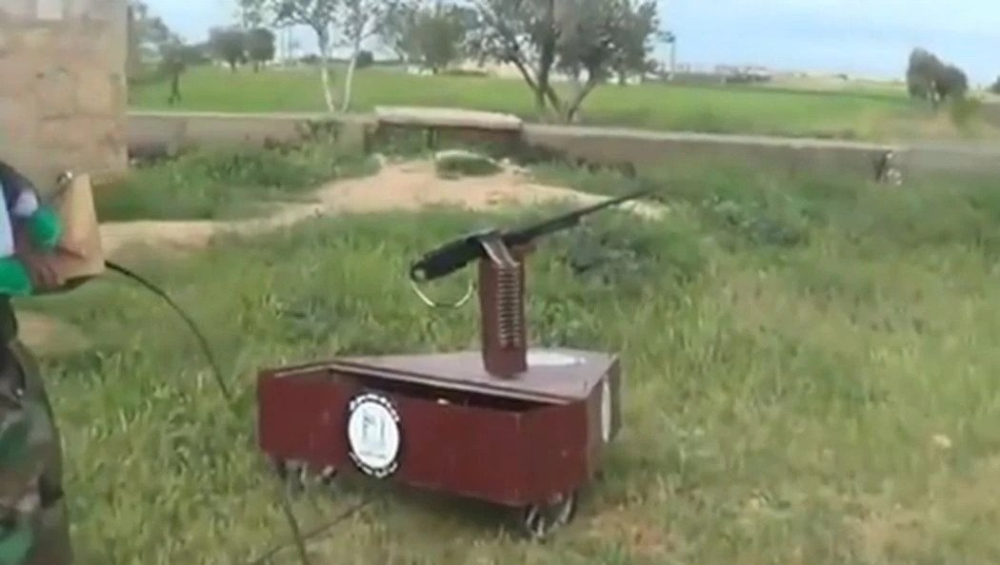
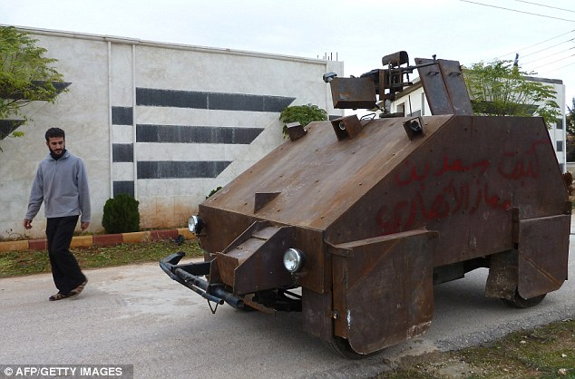

[`Image from Popular Science`](https://www.popsci.com/technology/article/2013-05/ten-improvised-weapons-made-syrian-rebels/?image=8)

Security and Innovation are described as going hand-in-hand. The logic is pretty simple: existential threats spur on unconventional allocation of resources towards R&D to outpace the enemy at the national level, and lack of resources and necessity drives improvisation and innovation on the ground.

But how does it actually happen? In today’s asymmetric conflicts, we’ve seen terrifyingly effective innovations in IEDs, remote controlled weapons platforms, and conventional arms in the form of home-modified pickup trucks, drones with grenades, AK47 turrets controlled with a playstation controller, or even rudimentary autonomous weapons platforms. All of these platforms are nominally being developed to balance the scales in asymmetric conflict, but the question of who, why, and how this work is being developed hasn't yet been approached systematically

## Overall Question

In general, I want to explore how technical innovation is developed within small, clandestine, violent organizations, primarily looking at insurgencies and terrorist organizations (with all the definitional complexity there).
Broadly then, these are some of the questions I want to ask:

- Considering armed guerilla groups and terrorist organizations, are there observable models of technical innovation that occur across groups?
- Are there consistent ways that technical and management problem solving emerges across orgs like AQI, the IRA, ISIS, the FSA, etc?
- Is there something inherent to the structure of these groups that produce a particular type of innovation?
- What commonalities, advantages, and/or disadvantages do these models have when compared with models of innovation within conventional state-based war-fighting organizations?
- How might such models might be compared?
- Who are the catalysts and maintainers of these innovation cycles, and does this frame on value and innovation change our understanding of who catalyzes what in these organizations?
- What kinds of traits to these individuals share with other innovators in the private sector, academia, and government?

## Why this Topic?

I was surprised by [the remote gun platforms](https://www.vice.com/en_us/article/z4mmve/people-are-still-killing-each-other-with-diy-weapons-in-syria) coming out of Syria and ISIS-occupied Mosul in Iraq. I come from a self-taught engineering and development background: building music and artwork with electronics and software that ultimately turned into a career in innovation and design. Those same skills that I learned in workshops or self-taught online are being applied in conflict zones.

In subsequent exploration, some of the techniques for building and sharing these creations felt a bit too familiar and I'm curious to dig deeper. My intent is to explore how and if there are consistent and observable ways that these innovations are created, disseminated, and scaled within and between organizations. One tangible example might the SVBIED factories that ISIS managed, and the way that [the platforms evolved across the conflict and between cells](https://international-review.org/an-analysis-of-islamic-states-svbied-use-in-raqqa/).

The reason for approaching this as a masters thesis is two fold. First, it will hopefully let me leverage my professional experience to bring a different lens to the work, and do so in collaboration with my advisors. Second, I'm hoping to take two approaches to this: an empirical and a critical approach. I'll talk about that later.

## Why Me?

Despite a political science degree, I’ve worked for a decade in startups and innovation consulting. Working within both small and large organizations, I've tried to surface the interesting loops within human systems and to apply learning from systems thinking in what I build (eg. Donna Meadows, John Boyd, and more contemporary design thinking work). In this case, I want to do this research based off of the artifacts of the organizations instead of directly observing it as a consultant, employee, or ethnographer might. More broadly, I want to explore whether there is a certain inevitability in the innovation capacity of a business relative to its structure, and whether the same can be said the organizations I propose to study.

## Research Methods

I hope to leverage databases like [Westpoint’s Harmony DB](https://ctc.usma.edu/harmony-program/) (captured and translated management literature from terror orgs, especially AQI) and mimic some of the methodologies that Jacob Shapiro describes in [The Terrorist’s Dilemma](https://press.princeton.edu/books/hardcover/9780691157214/the-terrorists-dilemma). I also find work by Erica Chenoweth to be incredibly inspiring, and have been closely reading her approaches. I plan on leveraging as much social media content from YouTube, twitter, reddit, etc. as possible to try and understand timelines of “innovation” moving across groups.

As a starting point, I'm initially taking a look at an unclassified US Army report on remote and tele-operated weapons, the substantial reporting around these DIY weapons in Syria and Iraq, and forums like Reddit's [/r/ShittyTechnicals/](https://www.reddit.com/r/shittytechnicals) (though I don't know if Technicals count in this case). In addition, arms researchers like CalibreObscura and other OSINT-like researchers have used methodologies that might be borrowed and learned from. It is unlikely that I will do interviews with current/former combatants for a variety of reasons, both ethical and practical.

[`Sham II from Daily Mail`](https://www.dailymail.co.uk/news/article-2245815/Syrian-rebels-unveil-Mad-Max-style-home-tank-controlled-Playstation-gamepad.html)

## Critical Lens

Doing this research in the international security studies context and still following the post-structural framing we’ve been introduced to so far is a point of some anxiety. I’m committed to take as empirical an approach as I can to this work, but I think the analysis of bureaucratic data might highlight interesting details on the "who" involved in these innovations.
This raises some interesting questions:

- How do these innovations shift power relationships and who serves to drive those innovations forward?
- Where are the inventors and makers coming from?
- What kind of power do these makers hold within these organizations relative to others?

## Wrapping Up

All this said, I'm excited to do this work. While many are still living the conflicts that birthed these deadly creations, the past decades of multi-party asymmetric conflict have left a trove of media and data to be considered in understanding just how technical and management innovation emerge in organizations to weak to engage in conventional warfare. My hope is this work can serve to make some small contribution in highlighting mechanisms to interdict the worst of these innovations, especially those used in the targeting of non-combatants.
